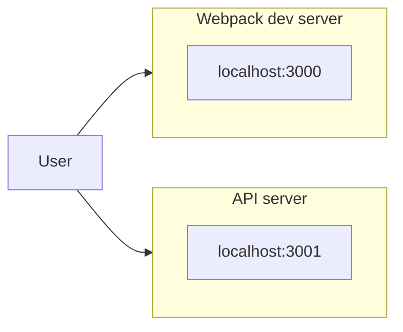
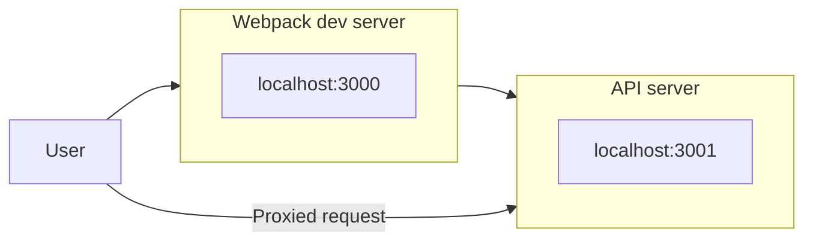

# Using Webpack with Create React App

## Table of contents

1. [Introduction](#introduction)
2. [JavaScript modules](#javascript-modules)
3. [Create React App](#create-react-app)
   - [`public/index.html`](#publicindexhtml)
   - [`package.json`](#packagejson)
   - [Scripts](#scripts)
   - [`src/`](#src)
   - [`App.js`](#appjs)
   - [`index.js`](#indexjs)
4. [Booting the App](#booting-the-app)
5. [Webpack basics](#webpack-basics)
6. [Making modifications to the sample app](#making-modifications-to-the-sample-app)
7. [Creating a production build](#creating-a-production-build)
8. [Ejecting](#ejecting)
9. [Using Create React App with an API server](#using-create-react-app-with-an-api-server)
   - [`.babelrc`](#babelrc)
   - [The server](#the-server)
   - [`Client`](#client)
10. [Concurrently](#concurrently)
11. [Webpack development proxy](#webpack-development-proxy)

---

## Introduction

In most of our earlier projects, we loaded React with `script` tags in our apps' `index.html`. And because we've been using ES6, we've also been loading the Babel library with `script` tags.

```html
<script src="vendor/react.js"></script>
<script src="vendor/react-dom.js"></script>
<script src="vendor/babel-standalone.js"></script>
```

This approach has limitation, the most pressing one is the lack of support for JavaScript modules

---

## JavaScript modules

The time tracking app had a Client module. That module's file defined a few functions. It then set `window.client` to an object that exposed each function as a property. The Client module only exposed these functions. These are the Client module's public methods. The file `public/js/client.js` also contained other function definitions, like `checkStatus()`, which verifies that the server returned a 2xx response code. `checkStatus()` is kept private. That's the idea behind a module in software. You have some self-contained component of a software system that is responsible for some discrete functionality. The module exposes a limited interface to the rest of the system, ideally the minimum viable interface the rest of the system needs to effectively use the module. In React, we can think of each of our individual components as their own modules. Each component is responsible for some discrete part of our interface. React components might contain their own state or perform complex operations, but the interface for all of the same is the same: they accept inputs (`props`) and outpur their DOM representation (`render`). In order for our React components to be truly modular, we'd ideally have them live in their own files. In the upper scope of that file, the component might define a styles object or helper functions that only the component uses. But we want our component-module to only expose the component itself. Until ES6, modules were not natively supported in JavaScript. Developers would use a variety of different techniques to make modular JavaScript. Some solutions only work in the browser, relying on the browser environment (like the presence of `window`). Others only work in Node.js. Browsers don't yet support ES6 modules. But ES6 modules are the future. The syntax is intuitive, we avoid bizarre tactics employed in ES5, and they work both in and outside of the browser. Because of this, the React community has quickly adopted ES6 modules. Due to complexity of module systems, we can't simply use ES6's import/export syntax and expect it to "just work" in the browser, even with Babel. JavaScript bundlers allow us to write modular ES6 JavaScript that works seamlessly in the browser. Bundlers pack numerous advantages: they provide a strategy for both organizing and distributing web apps; they have powerful toolchains for both iterating in development and producing production-optimized builds. The React community's favorite bundler is Webpack. However, bundlers like Webpack come with a significant trade-off: They add complexity to the setup of your web application. Initial configuration can be difficult and you ultimately end up with an app that has more moving pieces. n response to setup and configuration woes, the community has created loads of boilerplates and libraries developers can use to get started with more advanced React apps. But the React core team recognized that as long as there wasn't a core team sanctioned solution, the community was likely to remain splintered. The first steps for a bundler-powered React setup can be confusing for novice and experienced developers alike.

---

## Create React App

The `create-react-app` library provides a command you can use to initiate a new Webpack-powered React app

```sh
❯ create-react-app my-app-name
```

The library will configure a "black box" Webpack setup for you. It provides you with the benefits of a Webpack setup while abstracting away the cconfiguration details. To use Create React App, we can install it globally from the command line using the `-g` flag

```sh
❯ npm i -g create-react-app@1.4.1
```

> For the course we're using the version 1.4.1 specified by `@1.4.1`. It is recommended as it is the same version tested with the code provided with the course. To install the latest version use
>
> ```sh
> ❯ npm i -g create-react-app@latest
> ```

We're going to create a new app called `heart-webpack`:

```sh
❯ create-react-app heart-webpack --scripts-version=1.0.14
```

This will create the boilerplate for the new app and install the app's dependencies. The `--scripts-version` flag ensures that `react-scripts` is the same as the one used in the book

```sh
❯ cd heart-webpack/
❯ ls -1p
node_modules/
package.json
package-lock.json
public/
README.md
src/
```

Inside `src/` is a sample React app that Create React App has provided for demonstration purposes.

### `public/index.html`

```html
<!DOCTYPE html>
<html lang="en">
  <head>
    <meta charset="utf-8" />
    <meta
      name="viewport"
      content="width=device-width, initial-scale=1, shrink-to-fit=no"
    />
    <meta name="theme-color" content="#000000" />
    <!--
      Comment omitted
    -->
    <link rel="manifest" href="%PUBLIC_URL%/manifest.json" />
    <link rel="shortcut icon" href="%PUBLIC_URL%/favicon.ico" />
    <!--
      Comment omitted
    -->
    <title>React App</title>
  </head>
  <body>
    <noscript> You need to enable JavaScript to run this app. </noscript>
    <div id="root"></div>
    <!--
     Comment omitted
    -->
  </body>
</html>
```

The stark difference from the `index.html` we've used in previous apps: there are no `script` tags here.

### `package.json`

```json
{
  "name": "heart-webpack",
  "version": "0.1.0",
  "private": true,
  "devDependencies": {
    "react-scripts": "1.1.1",
    "concurrently": "3.4.0"
  },
  "dependencies": {
    "react": "16.12.0",
    "react-dom": "16.12.0"
  },
  "scripts": {
    "start": "react-scripts start",
    "build": "react-scripts build",
    "test": "react-scripts test --env=jsdom",
    "eject": "react-scripts eject"
  }
}
```

`package.json` specifies a single development dependency, `react-scripts`. Create React App is just a boilerplate generator. That command produced the folder structure of our new React app, inserted a sample app, and specified our `package.json`. It's actually the `react-scripts` package that makes everything work. `react-scripts` specifies all of our app's development dependencies, like Webpack and Babel. Under `dependencies`, we see `react` and `react-dom` listed. Webpack gives us the ability to use npm packages in the browser. We can specify external libraries that we'd like to use in `package.json`

### Scripts

`package.json` specifies four commands under `scripts`. Each executes a command with `react-scripts` At a high-level:

- `start`: Boots the Webpack development HTTP server. This server will handle requests from our web browser
- `build`: For use in production, this command creates an optimized, static bundle of all our assetss
- `test`: Executes the app's test suite, if present
- `eject`: Moves the innards of `react-scripts` into your project's directory. This enables you to abandon the configuration that `react-scripts` provides, tweaking the configuration to your liking.

> When you run `npm i`, npm will check the environment variable `NODE_ENV` to see if it's installing packages in a production environment. In production, npm only installs packages listed under `dependencies`. In development, npm installs all packages

### `src/`

Inside of `src/`, we see some JavaScript files:

```sh
❯ ls src/ -1p
App.css
App.js
App.test.js
index.css
index.js
logo.svg
registerServiceWorker.js
```

### `App.js`

Create React App has created a boilerplate React app which has a single component, `App`:

```javascript
import React, { Component } from "react";
import logo from "./logo.svg";
import "./App.css";

class App extends Component {
  render() {
    return (
      <div className="App">
        <div className="App-header">
          
          <h2>Welcome to React</h2>
        </div>
        <p className="App-intro">
          To get started, edit <code>src/App.js</code> and save to reload.
        </p>
      </div>
    );
  }
}

export default App;
```

We import `React` and `Component` at the top of the file:

```javascript
import React, { Component } from "react";
import logo from "./logo.svg";
import "./App.css";
```

The other two `import`s aren't JavaScript. Webpack has you specify all your dependencies using this syntax. This is the ES6 module import syntax. Webpack will infer that by `"react"` we are referring to the npm package specified in our `package.json`. The `App` component itself is simple and does not employ state or props. Its return method is just markup. At the bottom of the file it specifies its export:

```javascript
export default App;
```

Our React component is entirely self-contained in this module. Any additional libraries, styles, and images could be specified at the top.

### `index.js`

```javascript
import React from "react";
import ReactDOM from "react-dom";
import App from "./App";
import "./index.css";

ReactDOM.render(<App />, document.getElementById("root"));
```

Stepping through this file, we first import both `react` and `react-dom`. Because we specified App as the default export from `App.js`, we can import it here. Note again that the relative path (./App) signals to Webpack that we're referring to a local file, not an npm package. At this point, we can use our `App` component just as we have in the past. We make a call to `ReactDOM.render()`, rendering the component to the DOM on the `root` div.

---

## Booting the App

```sh
❯ npm start
```

This boots the Webpack development server. Visiting `http://localhost:3000/`, we see the interfact for the sample app that Create React App has provided. Viewing the source code (`view-source:http://localhost:3000/`) will present the same HTML file present in `index.html`, save for one key difference: there is a `script` tag appended to the bottom of the `body`

```html
<script type="text/javascript" src="/static/js/bundle.js"></script></body>
```

This script tag references a `bundle.js`. The Webpack development server inserted this line into our `index.html`.

> This script defaults the server's port to `3000`. However, if it detects that the port is occupied, it will choose another.

---

## Webpack basics

With Create React App, our static assets are served by the Webpack development server that is booted when we run `npm start`. The original `index.html` did not contain any references to the React app. Webpack inserted a reference to `bundle.js` in `index.html` before serving it to our browser. If you look around on disk, `bundle.js` doesn't exist anywhere. The Webpack development server produces this file on the fly and keeps it in memory. When our browser makes a request to `localhost:3000/`, Webpack is serving its modified version of `index.html` and `bundle.js` from memory. From the page `view-source:http://localhost:3000/`, you can click on `/static/js/bundle.js` to open that file in your browser. It contains all the JavaScript code that our app needs to run. Not only does it contain the entire source for `App.js` -- it contains the entire source for the React library. Serching for `App.js` will show something like this

```javascript
/***/ "./src/App.js":
/*!********************!*\
  !*** ./src/App.js ***!
  \********************/
/*! exports provided: default */
/*! exports used: default */
/***/
```

The module itself is encapsulated inside of a function that looks like this:

```javascript
(function(module, __webpack_exports__, __webpack_require__) {
  //...
}
```

In `App.js` we imported the logo, which was used to set the `src` on an `img` tag in the component's markup. In the `App.js` Webpack moodule, the variable declaration of `logo` should look like this:

```javascript
var __WEBPACK_IMPORTED_MODULE_1__logo_svg__ = __webpack_require__(
  /*! ./logo.svg */ "./src/logo.svg"
);
```

Webpack treats everything as a module, including image assets like `logo.svg`. We can get an idea of what's going on by picking out a path of the `logo.svg` and visit its address, it should return the React logo:

```http
http://localhost:3000/static/media/logo.5d5d9eef.svg
```

So Webpack created a Webpack module for `logo.svg` by defining a function. `__webpack_require__()` is a Webpack's special module loader. So we know what is happening: Webpack has rolled up every conceivable "module" for our app into `bundle.js`. You might be asking: Why? The first motivation is universal to JavaScript bundlers. Webpack has converted all our ES6 modules into its own bespoke ES5-compatible module syntax. Furthermore, Webpack, like other bundlers, consolidated all our JavaScript modules into a single file. While it could keep JavaScript modules in separate files, having a single file maximizes performance. The initiation and conclusion of each file transfer over HTTP adds overhead. Bundling up hundreds or thousands of smaller files into one bigger one produces a notable speed-up. Webpack takes this module paradigm further than other bundlers, however. It applies the same modular treatment to image assets, CSS, and npm packages (like React and ReactDOM). This modular paradigm unleashes a lot of power.

---

## Making modifications to the sample app

The `react-scripts` package defines a start script. Think of this start script as a special interface to Webpack that contains some features and conventions provided by Create React App. At a high-level, the start script:

- Sets up the Webpack configuration
- Provides some nice formatting and coloring for Webpack's console output
- Launches a web browser if you're on OS X

One compelling development feature Webpack gives us is hot reloading. Hot reloading enables certain files in a web app to be hot-swapped on the fly whenever changes are detected without requiring a full page reload. We can change the speed at which the logo spins, or the color of the header's text and see changes instantly

> Webpack includes client-side code to perform hot reloading inside `bundle.js`. The Webpack client maintains an open socket with the server. Whenever the bundle is modified, the client is notifies via this websocket. The client then makes a request to the server, asking for a patch to the bundle. Instead of fetchin the whole bundle, the server will just send the client the code that client needs to execute to "hot swap" the asset. Webpack's modular paradigm makes hot reloading of assets possible. Recall that Webpack inserts CSS into the DOM inside `style` tags. To swap out a modified CSS asset, the client removes the previous `style` tags and inserts the new one. The browser renders the modification for the user, all without a page reload.
>
> Working in WSL, if the hot-reload doesn't work, one possible solution is to declare the `start` script like this: `"CHOKIDAR_USEPOLLING=true react-scripts start"`

Even though hot reloading is not supported for our JavaScript files, Webpack will still auto-reload the page whenever it detects changes. Because Webpack is at heart a platform for JavaScript development and deployment, there is an ever-growing ecosystem of plug-ins and tools for Webpack-powered apps.

---

## Creating a production build

For production, we want Webpack to write a bundle to disk. We'll end up with a production-optimized build of our HTML, CSS, and JavaScript. We could then serve these assets using whatever HTTP server we wanted. To share our app with the world, we'd just need to upload this build to an asset host, like Amazon's S3. After quitting the server if it's running with `CTRL+C`, run the `build` command

```sh
❯ npm run build
```

This will create a `build` folder in the project's root

```sh
❯ cd build
❯ ls -1p
asset-manifest.json
favicon.ico
index.html
manifest.json
service-worker.js
static/
```

If you look at this `index.html`, you'll note that Webpack has performed some additional processing that it did not perform in development. Most notably: there are no newlines. The entire file is on a single line. Newlines are not necessary in HTML and are just extra bytes. We don't need them in production.

```html
<!DOCTYPE html>
<html lang="en">
  <head>
    <meta charset="utf-8" />
    <meta
      name="viewport"
      content="width=device-width,initial-scale=1,shrink-to-fit=no"
    />
    <meta name="theme-color" content="#000000" />
    <link rel="manifest" href="/manifest.json" />
    <link rel="shortcut icon" href="/favicon.ico" />
    <title>React App</title>
    <link href="/static/css/main.9c1ebf63.css" rel="stylesheet" />
  </head>
  <body>
    <noscript>You need to enable JavaScript to run this app.</noscript>
    <div id="root"></div>
    <script type="text/javascript" src="/static/js/main.9c03e57c.js"></script>
  </body>
</html>
```

Instead of referencing a `bundle.js`, this `index.html` references a file in `static/`. This production `index.html` now has a `link` tag to a CSS bundle. In production, hot reloading capability is irrelevant. Therefore, Webpack deploys CSS normally.

> Webpack versions assets. We can see that our JavaScript bundle has a different name and is versioned (`main.<version>.js`). Asset versioning is useful when dealing with browser caches in production. If a file is changed, the version of that file will be changed as well. Client browsers will be forced to fetch the latest version

The `static/` folder is organized as follows:

```sh
❯ ls static -1p
css/
js/
media/
```

Checking out the folders individually:

```sh
❯ ls static/css -1p
main.9c1ebf63.css
main.9c1ebf63.css.map

❯ ls static/js -1p
main.9c03e57c.js
main.9c03e57c.js.map

❯ ls static/media -1p
logo.5d5d9eef.svg
```

If you open the CSS file, you'll see just two lines: The first is all of our app's CSS, stripped of all superfluous whitespace. The second line is a special comment declaring the location of the map file. The JavaScript file is even more packed. In development, `bundle.js` has some structure. You can pick apart where the individual modules live. The production build does not have this structure. What's more, our code has been both minified and uglified.

<details>
  <summary>Minification, uglification, and source maps</summary>
  >For production environments, we can significantly reduce the size of JavaScript files by converting them from a human-readable format to a more compact one that behaves exactly the same. The basic strategy is stripping all excess characters, like spaces. This process is called minification. Uglification (or obfuscation) is the process of deliberately modifying JavaScript files so that they are harder for humans to read. Again, the actual behavior of the app is unchanged. Ideally, this process slows down the ability for outside developers to understand your codebase. Both the `.css` and `.js` files are accompanied by a companion file ending in `.map.` The `.map` file is a source map that provides debugging assistance for production builds. Because they've been minified and uglified, the CSS and JavaScript for a production app are difficult to work with. If you encounter a JavaScript bug on production, for example, your browser will direct you to a cryptic line of this obscure code. Through a source map, you can map this puzzling area of the codebase back to its original, un-built form. [^1]
</details>

Last, the media folder will contain all of our app's other static files, like images and videos. This app only has one image, the React logo SVG file. Again, this bundle is entirely self-contained and ready to go. If we wanted to, we could install the same `http-server` package that we used in the first application and use it to serve this folder, like this:

```sh
http-server ./build -p 3000
```

Without the Webpack development server, you can imagine the development cycle would be a bit painful:

1. Modify the app
2. Run npm run build to generate the Webpack bundle
3. Boot/restart the HTTP server

---

## Ejecting

An eject will copy all the scripts and configuration encapsulated in `react-scripts` into your project's directory. It opens up the "black box", handing full control of your app back over to you. Performing an eject is also a nice way to strip some of the "magic" from Create React App.

> There is no backing out from an eject. Be careful when using this command. Should you decide to eject in the future, make sure your app is checked in to source control. You might consider duplicating that directory before proceeding. For example, you can do this:
>
> ```sh
> ❯ cp -r heart-webpack/ heart-webpack-ejected
> ```
>
> The `node_modules` folder does not behave well when it's moved wholesale like this, so you'll need to remove it and re-install
>
> ```sh
> ❯ cd heart-webpack-ejected && rm -rf node_modules && npm i
> ```

```sh
❯ npm run eject

> heart-webpack@0.1.0 eject
> react-scripts eject

? Are you sure you want to eject? This action is permanent. (y/N)
```

After all the files are copied from `react-scripts` into your directory, `npm install` will run. This is because all the dependencies for `react-scripts` have been dumped into our `package.json`. We have now two folders: `config/` and `scripts/`. Take a look at `package.json`. There are loads of dependencies. Some of these dependencies are necessary, like Babel and React. Others — like `eslint` and `whatwg-fetch` — are more "nice-to-haves." This reflects the ethos of the Create React App project: an opinionated starter kit for the React developer.

```sh
❯ ls scripts/ -1p
build.js
start.js
test.js
```

When we ran `npm start` and `npm run build` earlier, we were executing the scripts `start.js` and `build.js`.

```sh
❯ ls config/ -1p
env.js
jest/
paths.js
polyfills.js
webpack.config.dev.js
webpack.config.prod.js
webpackDevServer.config.js
```

`react-scripts` provided sensible defaults for the tools that it provides. In `package.json`, it specifies configuration for Babel. Here, it specifies configuration for Webpack and Jest. Of particular noteworthiness are the configuration files for Webpack.

---

## Using Create React App with an API server

`food-lookup` is the root of the app, here's the folder structure:

```sh
❯ ls -1p
client/
db/
package.json
package-lock.json
README.md
server.js
start-client.js
start-server.js
```

Inside of `client/` is where the React app lives, it was generated with Create React App

```sh
❯ ls -a1p client/
./
../
.babelrc
.gitignore
package.json
package-lock.json
public/
README.md
src/
```

> the `-a` flag for the `ls` command displays all files, including "hidden" files that are preceded by a `.` like `.babelrc`.

We have two `package.json` files. One sits in the root and specifies the packages that the server needs. And the other lives in `client/` and specifies the packages that the React app needs.

### `.babelrc`

```json
{
  "plugins": ["transform-class-properties"]
}
```

This plugin gives the property initializer syntax used at the end of the first chapter. In that project, we specified we wanted to use this plugin by setting the `data-plugins` attribute on the script tag for `app.js`. For this project, Babel is being included and managed by `react-scripts`. To specify plugins we'd like Babel to use for our Create React App projects, we must first include the plugin in our `package.json`. In order to boot our app, we need to install the packages for both the server and client:

```sh
❯ npm i
❯ cd client
❯ npm i
❯ cd ..
```

The app consists of three components:

- App: The parent container for the application
- SelectedFood: A table that lists selected foods. Clicking on a food item removes it
- FoodSearch: Table that provides a live search field. Clicking on a food item in the table adds it to the total (`SelectedFood`)

### The server

The command to boot the server is not yet defined inside `package.json`, so to run it we use the command:

```sh
npm run server
```

This server provides a single API endpoint `/api/food` which expect a single parameter, `q`, the food we are searching for

```sh
❯ curl -X GET  localhost:3001/api/food"?"q=hash+browns | jq "."
  % Total    % Received % Xferd  Average Speed   Time    Time     Time  Current
                                 Dload  Upload   Total   Spent    Left  Speed
100   467  100   467    0     0  72560      0 --:--:-- --:--:-- --:--:-- 77833
[
  {
    "carbohydrate_g": 28.88,
    "protein_g": 2.58,
    "fat_g": 16.04,
    "kcal": 272,
    "description": "Fast foods, potatoes, hash browns, rnd pieces or patty"
  },
  {
    "carbohydrate_g": 30.51,
    "protein_g": 3,
    "fat_g": 17.37,
    "kcal": 301,
    "description": "Chick-fil-a, hash browns"
  },
  {
    "carbohydrate_g": 26.59,
    "protein_g": 2.49,
    "fat_g": 8.76,
    "kcal": 197,
    "description": "Denny's, hash browns"
  },
  {
    "carbohydrate_g": 26.59,
    "protein_g": 2.49,
    "fat_g": 8.76,
    "kcal": 197,
    "description": "Restaurant, family style, hash browns"
  }
]
```

### `Client`

The `FoodSearch` component makes the call to `/api/foods`. It performs a request every time the user changes the search field. It uses a library, `Client`, to make the request. The `Client` module is defined in `client/src/Client.js`. It exports an object with one method, `search()`.

```javascript
function search(query, cb) {
  return fetch(`http://localhost:3001/api/food?q=${query}`, {
    accept: "application/json",
  })
    .then(checkStatus)
    .then(parseJSON)
    .then(cb);
}
```

We have two different servers we need to have running in order for our app to work. We need the API server running (at `localhost:3001`) and the Webpack development server running (at `localhost:3000`). If we have both servers running, they should presumably be able to communicate.

---

## Concurrently

Concurrently[^2] is a utility for running multiple processes. If you were writing your app to just work on Mac or Unix machines, you could do something like this:

```sh
❯ concurrently "npm run server" "cd client && npm start"
```

The `&:` operator is not cross-platform, so we've included a `start-client.js` script with the project, which can be launched from the top-level directory with the command

```sha
❯ babel-node start-client.js
```

```javascript
const args = ["start"];
const opts = { stdio: "inherit", cwd: "client", shell: true };
require("child_process").spawn("npm", args, opts);
```

The `start` and `client` commands must be added to our `package.json`:

```json
"scripts": {
    "start": "concurrently \"npm run server\" \"npm run client\"",
    "server": "babel-node start-server.js",
    "client": "babel-node start-client.js"
  },
```

As of now, the app doesn't work as intended. Our browser prevented our React app (hosted at `localhost:3000`) from loading a resource from a different origin (`localhost:3001)`. We attempted to perform Cross-Origin Resource Sharing. The browser prevent these types of requests from scripts for security reasons

```sh
Fetch API cannot load http://localhost:3001/api/food?q=c. No 'Access-Control-Allow-Origin' header is present on the requested resource. Origin 'http://localhost:3000' is therefore not allowed access. If an opaque response serves your needs, set the request's mode to 'no-cors' to fetch the resource with CORS disabled.
```

---

## Webpack development proxy

Create React App enables you to setup the Webpack development server to proxy requests to your API. Instead of making a request to the API server at `localhost:3001`, our React app can make requests to `localhost:3000`. We can then have Webpack proxy those requests to our API server.

Our original approach was to have the user's browser interact directly with both servers



However, we want the browser to just interact with the Webpack development server at `localhost:3000`. Webpack will forward along requests intended for the API



To do this. modify `client/src/Client.js` removing the base URL:

```javascript
function search(query, cb) {
  return fetch(`/api/food?q=${query}`, {
    accept: "application/json",
  })
    .then(checkStatus)
    .then(parseJSON)
    .then(cb);
}
```

Next, in our client's `package.json`, we can set a special property, `proxy`:

```json
{
  "name": "client",
  "version": "0.1.0",
  "private": true,
  "proxy": "http://localhost:3001",
  "devDependencies": {
    "react-scripts": "1.1.1",
    "concurrently": "3.4.0"
  },
  "dependencies": {
    "babel-plugin-transform-class-properties": "6.22.0",
    "react": "16.12.0",
    "react-dom": "16.12.0"
  },
  "scripts": {
    "start": "react-scripts start",
    "build": "react-scripts build",
    "test": "react-scripts test --env=jsdom",
    "eject": "react-scripts eject"
  }
}
```

[^1]: [JavaScript Source Maps](https://developer.chrome.com/blog/sourcemaps/)
[^2]: [Concurrently](https://github.com/open-cli-tools/concurrently)
