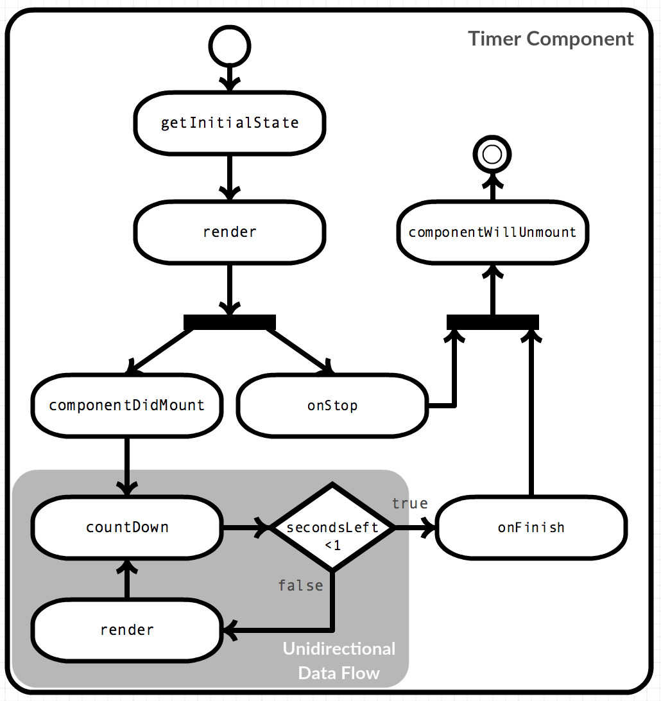

# Example App :tomato:

## Table of contents

1. [Implementation](#implementation)
2. [Idle Component](#idle-component)
3. [Timer Component](#timer-component)
4. [PomodoroApp Component](#pomodoroapp-component)
5. [Unidirectional Data Flow](#unidirectional-data-flow)

---

## Implementation

A pomodoro timer helps divide time into chunks.There are two types of time-chunks:

- Work time, which has a duration of 25 minutes
- Pause time, which has a duration of 5 minutes

We need to create three components for this app:
    - **`PomodoroApp`** - The root component of our app
    - **`Timer`** - The component that counts down for a specific duration
    - **`Idle`** - The component that is displayed when the timer isn't running

The HTML structure of our app looks like this:

```HTML
<div style="display: flex; flex-direction: column; align-items: center;">
    <h1>Pomodoro Timer</h1>
    <button>Start timer</button>
    <h2>No Timer Running.</h2>
</div>
```

---

## Idle Component

The `Idle` component is the simplest component in this app: it displays text and a button. It doesn't even have to handle the button click event itself so it can be a **functional component.**

```javascript
let Idle = function (props) {
    return (
        <React.Fragment>
        <button onClick={props.onStart}>Start timer</button>
        <h2>No Timer Running.</h2>
        </React.Fragment>
    );
};
```

We pass the `onClick` event to the `onStart` prop and wrap the two elements into a `React.Fragment` component, so they are rendered without any wrapping element into the dom later.

---

## Timer Component

The most interesting component. It handles the actual timer count-down, so it has to be a **class component**.
We'll start by creating the `Timer` component with just a `render()` method.

```javascript
let Timer = createReactClass({
    render: function() {
        return <span>Timer</span>
    }
})
```

The component needs to display a count-down, so let's add a method that does this:

```javascript
let Timer = createReactClass({
     countDown: function () {
        let onFinish = this.props.onFinish;
        this.setState(function (prevState) {
        let secondsLeft = prevState.seconds - 1;

        if (secondsLeft < 1) return onFinish();

        return { seconds: secondsLeft };
        });
    },
    render: function() {
        return <span>Timer</span>
    }
})
```

The `countDown()` method tries to decrement `state.seconds` every time it's called, and if the value is below 1, it calls the `props.onFinish()` callback. We haven't set an initial `state` yet. Without this, no `state.seconds` would be available.

```javascript
let Timer = createReactClass({
    getInitialState: function () {
        return { seconds: this.props.minutes * 60 };
    },

    countDown: function () {
        let onFinish = this.props.onFinish;
        this.setState(function (prevState) {
        let secondsLeft = prevState.seconds - 1;

        if (secondsLeft < 1) return onFinish();

        return { seconds: secondsLeft };
        });
    },
    render: function() {
        return <span>Timer</span>
    }
})
```

The `getInitialState()` method is called by React **before rendering the first time.** We use the `minutes` props to calculate the seconds we need. Or timers run in multiples of one minute, so using minutes as a unit in the `props` makes it easier to configure our component. However, because we will count-down per second, then we want to store seconds in the `state`.
The next step is to wire up the `countDown()` method:


```javascript
let Timer = createReactClass({
    getInitialState: function () {
        return { seconds: this.props.minutes * 60 };
    },

    interval: null,
    componentDidMount: function () {
        this.interval = setInterval(this.countDown, 1000);
    },
    componentWillUnmount: function () {
        clearInterval(this.interval);
    },

    countDown: function () {
        let onFinish = this.props.onFinish;
        this.setState(function (prevState) {
        let secondsLeft = prevState.seconds - 1;

        if (secondsLeft < 1) return onFinish();

        return { seconds: secondsLeft };
        });
    },
    render: function() {
        return <span>Timer</span>
    }
})
```

To call the `countDown()` method we use an interval that calls the method every 1000 milliseconds. We also need to start this interval somewhere.
The `componentDidMount()` method is called right after the first render so we can use it to call the `setInterval()` function, which starts our interval. We also need to store a handle (a reference) to the interval in a place that can be read later so we can stop the timer (`this.interval`).
React calls the `componentWillUnmount()` method before the component gets removed from the DOM, so here we can use the `clearInterval()` function to stop our interva. If we didn't call `clearInterval()`, the `countDown()` method would continue call the `setState()` method -- even after the instance of the component has already been destroyed.
Now our `Timer` component is configurable via `props` and counts down its timer every second until it is removed from the DOM. When the timer gets below 1 second, it executes the `onFinish()` callback. The only thing left now is to display our time:

```javascript
let Timer = createReactClass({
    getInitialState: function () {
        return { seconds: this.props.minutes * 60 };
    },

    interval: null,
    componentDidMount: function () {
        this.interval = setInterval(this.countDown, 1000);
    },
    componentWillUnmount: function () {
        clearInterval(this.interval);
    },

    countDown: function () {
        let onFinish = this.props.onFinish;
        this.setState(function (prevState) {
        let secondsLeft = prevState.seconds - 1;

        if (secondsLeft < 1) return onFinish();

        return { seconds: secondsLeft };
        });
    },
    render: function () {
        let seconds = this.state.seconds;
        let minutes = Math.floor(seconds / 60);
        seconds = seconds % 60;

        return (
        <React.Fragment>
            <button onClick={this.props.onStop}>Stop timer</button>
            <h2 style={{ color: this.props.color }}>
            {this.props.title} for {minutes} minutes and {seconds} seconds.
            </h2>
        </React.Fragment>
        );
    },
});
```

`Timer` calculates `minutes` and `seconds` from the `state.seconds` to display them in a user-friendly way. Since we used `setState()` to update the `seconds` the `render()` method is called every time the `countDown()` method was called.

---

## PomodoroApp Component

The `PomodoroApp` component handles the transition between the state of the timer, so it needs to be a class component.

```javascript
let PomodoroApp = createReactClass({
  render: function () {
    return <span>Pomodoro Timer</span>;
  },
});
```

The `PomodoroApp` component keeps track of two different types of state.
- The current state of the timer.
- The count of work timers that finished

```javascript
let PomodoroApp = createReactClass({
  IDLE: 0,
  WORK: 1,
  PAUSE: 2,

  getInitialState: function () {
    return {
      count: 0,
      timerState: this.IDLE,
    };
  },

  render: function () {
    return <span>Pomodoro Timer</span>;
  },
});
```

The current state of the timer can be one of three states, `IDLE`, `WORK` and `PAUSE`. The `UPPER_CASE` writing implies they are constants. The count of work timers that finished merely is a number. Then we have to set the initial `state` in the `getInitialState()` method. The app starts in an idle state without any timer running, so we use `this.IDLE`.
Next, we need to integrate our `<Idle>` and `<Timer>` components.

```javascript
let PomodoroApp = createReactClass({
  IDLE: 0,
  WORK: 1,
  PAUSE: 2,

  getInitialState: function () {
    return {
      count: 0,
      timerState: this.IDLE,
    };
  },

  render: function () {
    let count = this.state.count;
    let timerState = this.state.timerState;

    let timerElement = <Idle onStart={this.handleWorkd} />;

    if (timerState == this.WORK)
      timerElement = (
        <Timer
          key="work"
          title="Work"
          color="orange"
          minutes={25}
          onFinish={this.handlePause}
          onStop={this.handleIdle}
        />
      );

    if (timerState == this.PAUSE)
      timerElement = (
        <Timer
          key="pause"
          title="Pause"
          color="green"
          minutes={5}
          onFinish={this.handleWork}
          onStop={this.handleIdle}
        />
      );

    return (
      <div
        style={{
          display: "flex",
          flexDirection: "column",
          alignItems: "center",
        }}
      >
        <h1>Pomodoro Timer</h1>
        {timerElement}
        {!!count && <h2>You worked {count * 25} minutes today!</h2>}
      </div>
    );
  },
});
```

If the `timerState` is `this.IDLE`, we use the `<Idle>` component and hook its `onStart` prop up to an event handler that handles the start of a work-timer. 
If the `timerState` is `this.Work`, we use the `<Timer>` component and configure it via `props` to behave like a work-timer. We also hook-up event handlers for `onFinish` and `onStop` events of the `<Timer>` component, so we can swithc to other `timerState`s when needed 
If the timerState is `this.PAUSE`, we also use the `<Timer>` component, but this time configured differently to resemble a pause-timer, we also add the event handlers to switch `timerState`s.

>We use two instances of the `<Timer>` component in the same place. In one state we configure it as work-timer in another state we configure it as pause-timer. This tells React that we want to reuse the component, but only change the config. We need to supply different `key` props to tell React these are different components that just happen to be in the same place at different times, otherwise React wouldn't reset the `<Timer>` components state when `timerState` changed

The <PomodoroApp> component also has some markup on its own to show a title and use state.count to display minutes the user already worked.
We know a Pomodoro working timer always takes 25 minutes, so we can multiply the count by 25 to get the right amount of minutes. The `!!count &:` prevents the `<h2>` from being rendered when `count` is 0.
We can refactor the component and add the event handlers.

```javascript
let PomodoroApp = createReactClass({
  IDLE: 0,
  WORK: 1,
  PAUSE: 2,

  getInitialState: function () {
    return {
      count: 0,
      timerState: this.IDLE,
    };
  },

  handleWork: function () {
    this.setState({ timerState: this.WORK });
  },

  handlePause: function () {
    this.setState(function (prevState) {
      return {
        count: prevState.count + 1,
        timerState: this.PAUSE,
      };
    });
  },

  handleIdle: function () {
    this.setState({ timerState: this.IDLE });
  },

  getTimerElement: function () {
    let timerState = this.state.timerState;

    if (timerState == this.PAUSE)
      return (
        <Timer
          key="pause"
          title="Pause"
          color="green"
          minutes={5}
          onFinish={this.handleWork}
          onStop={this.handleIdle}
        />
      );

    if (timerState == this.WORK)
      return (
        <Timer
          key="work"
          title="Work"
          color="orange"
          minutes={25}
          onFinish={this.handlePause}
          onStop={this.handleIdle}
        />
      );

    return <Idle onStart={this.handleWork} />;
  },

  style: {
    display: "flex",
    flexDirection: "column",
    alignItems: "center",
  },

  render: function () {
    let count = this.state.count;
    return (
      <div>
        <h1>Pomodoro Timer</h1>
        {this.getTimerElement()}
        {!!count && <h2>You worked {count * 25} minutes today!</h2>}
      </div>
    );
  },
});
```

The `handleWork()` method sets the `timerState` to `this.WORK` and is called via the `onStart` prop of the `<Idle>` component and the `onFinish` prop of the `<Timer>` component, but only when we configure the `<Timer>` component as pause-timer. The `onStart` prop gets called by a press on the start button of the `<Idle>` component. We execute the `onFinish` callback if the interval in the `<Timer>` component goes under 1.
The `handlePause()` method sets the `timerState` to `this.PAUSE` and increments the count, so we can display how many work-timers have finished successfully. We only call it via the `onFinish` prop of the `<Timer>` component, if we configured the `<Timer>` component as a work timer.
We call the `onFinish` callback if the interval in the `<Timer>` component goes under 1.
We call the `handleIdle()` method via the `onStop` callback of the `<Timer>` component, which in turn uses its stop button's `onClick` event. This execution is indifferent to the timer being a work-timer or pause-timer.

---

## Unidirectional Data Flow

The `<Timer>` component also shows how unidirectional data flow gives you more control about events. To display the right minutes and seconds in the text **we explicitly set the state** in the `countDown()` method and then use it in the `render()` method. **There is no two-way-binding** involved.
This approach allows us to see the whole journey our value takes, and we can apply checks or modify it at any position. For example, we check if the updated value is smaller than 1 and we calculate minutes and seconds from the value before rendering it.

<div align="center">
    
</div>