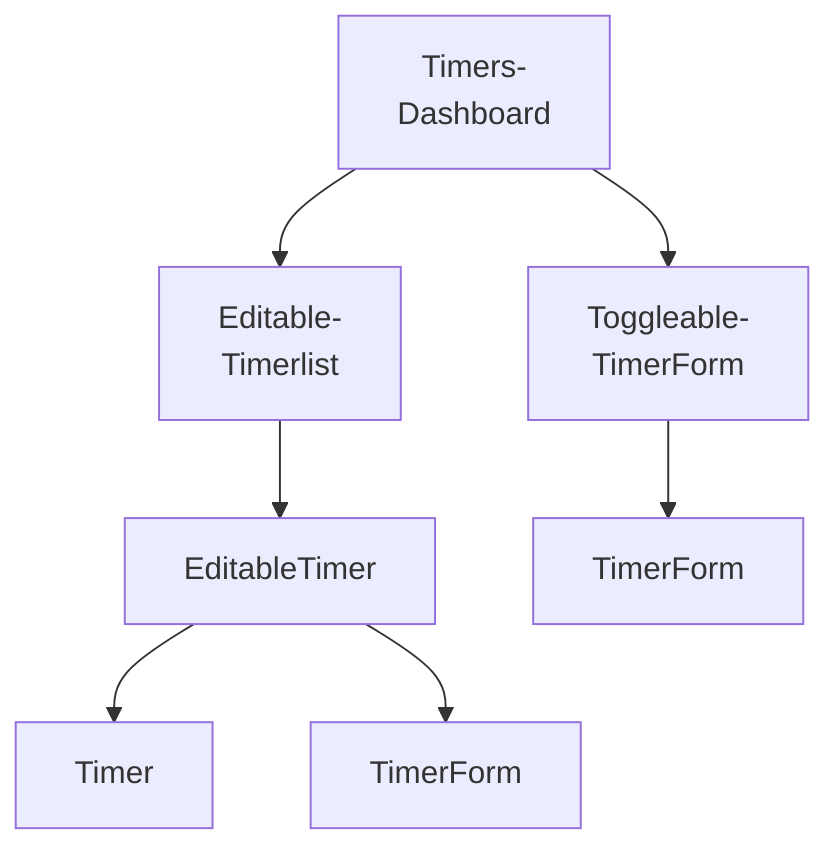

# Components

## Table of contents

1. [Breaking the app into components](#breaking-the-app-into-components)
2. [Steps for building React apps from scratch](#steps-for-building-react-apps-from-scratch)
3. [Build a static version of the app](#build-a-static-version-of-the-app)
4. [Determine what should be stateful](#determine-what-should-be-stateful)
5. [Determine in which component each piece of state should live](#determine-in-which-component-each-piece-of-state-should-live)
6. [Hard-code initial states](#hard-code-initial-states)
7. [Add inverse data flow](#add-inverse-data-flow)
   - [Updating timers](#updating-timers)
   - [Adding timing functionality](#adding-timing-functionality)
8. [Review](#review)
9. [Components and servers]()

---

## Breaking the app into components



- `TimersDashboard`: Parent container
  - `EditableTimerList`: Displays a list of timer containers
    - `EditableTimer`: Displays either a timer or a timer's edit form
      - `Timer`: Displays a given timer
      - `TimerForm`: Displays a given timer's edit form
  - `ToggleableTimerForm`: Displays a form to create a new timer
    - `TimerForm`: Displays a new timer's create form

<details>
    <summary>More details</summary>

> This app is structured by using two components: `TimerList` and `Timer`. However, the list of timers has a "+" icon at the bottom, used to add new timers. So the `TimerList` component also contains a widget to create new timers. Think about components as you would functions or objects. The single responsibility principle[^1] applies. A component should, ideally, only be responsible for one piece of functionality. Let's shrink `TimerList` back into its responsibility of just listing timers and to nest it under a parent component `TimersDashboard`. Not only does this separation of responsibilities keep components simple, but it often also improves their re-usability. In the future, we can now drop the `TimerList` component anywhere in the app where we just want to display a list of timers. This component no longer carries the responsibility of also creating timers, which might be a behavior we want to have for just this dashboard view. The "+" button has two distinc representations. When the "+" is clicked, the widget transmutes into a form. When the form is close, the widget transmutes back into a "+" button. There are two approaches we could take. The first one is to have the parent component, `TimersDashboard`, decide whether or not to render a “+” component or a form component based on some piece of stateful data. It could swap between the two children. However, this adds more responsibility to `TimersDashboard`. The alternative is to have a new child component own the single responsibility of determining whether or not to display a “+” button or a create timer form. We’ll call it `ToggleableTimerForm`. As a child, it can either render the component `TimerForm` or the HTML markup for the “+” button. The timer itself has a fair bit of functionality. It can transform into an edit form, delete itself, and start and stop itself. Do we need to break this up? And if so, how? Displaying a timer and editing a timer are indeed two distinct UI elements. They should be two distinct React components. Like `ToggleableTimerForm`, we need some container component that renders either the timer’s face or its edit form depending on if the timer is being edited. We’ll call this `EditableTimer`. The child of `EditableTimer` will then be either a `Timer` component or the edit form component. As for the other functionality of the timer, like the start and stop buttons, it’s a bit tough to determine at this point whether or not they should be their own components. We can trust that the answers will be more apparent after we’ve written some code. Working back up the component tree, we can see that the name `TimerList` would be a misnomer. It really is a `EditableTimerList`.

</details>

---

## Steps for building React apps from scratch

The server will be the initial source of state, and React will render itself according to the data the server provides. Our app will also send updates to the server. Our React components will do little more than render HTML. A handy framework for developing a React app from scratch (we followed this pattern in the last project):

<details>
    <summary><b>1. Break the app into components</b></summary>

> We looked at the desired UI and determined we wanted `ProductList` and `Product` components.

</details>
<details>
    <summary><b>2. Build a static version of the app</b></summary>

> Our components started off without using `state`. Instead, we had `ProductList` pass down static props to `Product`

</details>
<details>
    <summary><b>3. Determine what should be stateful</b></summary>

> In order for our application to become interactive, we had to be able to modify the vote property on each product. Each product had to be mutable and therefore stateful.

</details>
<details>
    <summary><b>4. Determine in which component each piece of state should live</b></summary>

> `ProductList` managed the voting state using React component class methods.

</details>
<details>
    <summary><b>5. Hard-code initial state</b></summary>

> When we re-wrote `ProductList` to use `this.state`, we seeded it from `Seed.products`.

</details>
<details>
    <summary><b>6. Add inverse data flow</b></summary>

> We defined the `handleUpvote` function in `ProductList` and passed it down in props so that each `Product` could inform `ProductList` of up-vote events.

</details>
<details>
    <summary><b>7. Add server communication</b></summary>

> Will be covered in this project

</details>

---

## Build a static version of the app

```javascript
class TimersDashboard extends React.Component {
  render() {
    return (
      <div className="ui three column centered grid">
        <div className="column">
          <EditableTimerList />
          <ToggleableTimerForm isOpen={true} />
        </div>
      </div>
    );
  }
}
```

This component renders its two child components nested under `div` tags. `TimersDashboard` passes down one prop to `ToggleableTimerForm`: `isOpen`. This is used by the child component to determine whether to render a "+" or `TimerForm`: when is "open' the form is being displayed.

```javascript
class EditableTimerList extends React.Component {
  render() {
    return (
      <div id="timers">
        <EditableTimer
          title="Learn React"
          project="Web Domination"
          elapsed="8986300"
          runningSince={null}
          editFormOpen={false}
        />
        <EditableTimer
          title="Learn extreme ironing"
          project="World Domination"
          elapsed="3890985"
          runningSince={null}
          editFormOpen={true}
        />
      </div>
    );
  }
}
```

We're passing five props to each child component.

```javascript
class EditableTimer extends React.Component {
  render() {
    if (this.props.editFormOpen) {
      return (
        <TimerForm title={this.props.title} project={this.props.project} />
      );
    } else {
      return (
        <Timer
          title={this.props.title}
          project={this.props.project}
          elapsed={this.props.elapsed}
          runningSince={this.props.runningSince}
        />
      );
    }
  }
}
```

`EditableTimer` returns either a `TimerForm` or a `Timer` based on the prop `editFormOpen`

```javascript
class TimerForm extends React.Component {
  render() {
    const submitText = this.props.title ? "Update" : "Create";
    return (
      <div className="ui centered card">
        <div className="content">
          <div className="ui form">
            <div className="field">
              <label>Title</label>
              <input type="text" defaultValue={this.props.title} />
            </div>
            <div className="field">
              <label>Project</label>
              <input type="text" defaultValue={this.props.project} />
            </div>
            <div className="ui two bottom attached buttons">
              <button className="ui basic blue button">{submitText}</button>
              <button className="ui basic red button">Cancel</button>
            </div>
          </div>
        </div>
      </div>
    );
  }
}
```

Before the `return` statement, we define a variable `submitText`. This variable uses the presence of `this.props.title` to determine what text the submit button should display.

```javascript
class ToggleableTimerForm extends React.Component {
  render() {
    if (this.props.isOpen) {
      return <TimerForm />;
    } else {
      return (
        <div className="ui basic content center aligned segment">
          <button className="ui basic button icon">
            <i className="plus icon" />
          </button>
        </div>
      );
    }
  }
}
```

As noted earlier, `TimerForm` does not receive any props from `ToggleableTimerForm`. As such, `itstitle` and `project` fields will be rendered empty.

```javascript
class Timer extends React.Component {
  render() {
    const elapsedString = helpers.renderElapsedString(this.props.elapsed);
    return (
      <div className="ui centered card">
        <div className="content">
          <div className="header">{this.props.title}</div>
          <div className="meta">{this.props.project}</div>
          <div className="center aligned description">
            <h2>{elapsedString}</h2>
          </div>
          <div className="extra content">
            <span className="right floated edit icon">
              <i className="edit icon" />
            </span>
            <span className="right floated trash icon">
              <i className="trash icon" />
            </span>
          </div>
        </div>
        <div className="ui bottom attached blue basic button">Start</div>
      </div>
    );
  }
}
```

`elapsed` in this app is in milliseconds. We use a function defined in `helpers.js`, `renderElapsedString()` to render the string in the format "HH:MM:SS"
With all of the components defined, is time to render the app with `ReactDOM.render()`:

```javascript
ReactDOM.render(<TimersDashboard />, document.getElementById("content"));
```

---

## Determine what should be stateful

- `TimersDashboard`

  - `isOpen` boolean for `ToggleableTimerForm`

**Stateful**. The data is defined in this component, changes over time, and cannot be computed from other state or props.

- `EditableTimerList`

  - Timer properties

**Stateful**. The data is defined in this component, changes over time, and cannot be computed from other state or props.

- `EditableTimer`

  - `editFormOpen` for a given timer

**Stateful**. The data is defined in this component, changes over timer, and cannot be computed from other state or props.

- `Timer`

  - Timer properties

In this context, **not stateful**. Properties are passed down from the parent.

- `TimerForm`

We might be tempted to conclude that `TimerForm` doesn't manage any stateful data, as `title` and `project` are props passed down from the parent. However forms are special state managers in their own right.
So, outside of TimerForm, we’ve identified our stateful data:

- The list of timers and properties of each timer
- Whether or not the edit form of a timer is open
- Whether or not the create form is open

<details>
    <summary>More details</summary>

> - `TimersDashboard`
>   - In our static app, this declares two child components. It sets one prop, which is the `isOpen` boolean that is passed down to `ToggleableTimerForm`

> - `EditableTimerList`
>   - This declares two child components, each which have props corresponding to a given timer's properties

> - `EditableTimer`
>   - This uses the prop `editFormOpen`

> - `Timer`
>   - This uses all the props for a timer.

> - `TimerForm`

> - This has two interactive input fields, one for `title` and one for `project`. When editing an existing timer, these fields are initialized with the timer's current values.

> We can apply criteria to determine if data should be stateful: [^2]

> 1.  Is it passed in from a parent via props? If so, it probably isn't state.
>     - A lot of the data used in our child components are already in their parents. This criterion helps us de-duplicate. For example, "timer properties" is listed multiple times. When we see the properties declared in `EditableTimerList`, we can consider it state. But when we see it elsewhere it's not
> 2.  Does it change over time? If not, it probably isn't state.
>     - This is a key criterion of stateful data: it changes
> 3.  Can you compute it based on any other state or props in your component? If so, it's not state.
>     - For simplicity, we want to strive to represent state with as few data points as possible.

</details>

---

## Determine in which component each piece of state should live

While the data we've determined to be stateful might live in certain components in our static app, this does not indicate the best position for it in our stateful app. Our next task is to determine the optimal place for each of our three discrete pieces of state to live.
For each piece of state: [^2]

- Identify every component that renders something based on that state.
- Find a common owner component (a single component above all the components that need the state in the hierarchy)
- Either the common owner or another component higher up in the hierarchy should own the state
- If you can't find a component where it makes sense to own the state, create a new component simply for holding the state and add it somewhere in the hierarchy above the common owner component.

<details>
  <summary>More details</summary>

> At first glance, we may be tempted to conclude that `TimersDashboard` does not appear to use this state. Instead, the first component that uses it is `EditableTimerList`. This matches the location of the declaration of this data in our static app. Because `ToggleableTimerForm` doesn’t appear to use the state either, we might deduce that `EditableTimerList` must then be the common owner. While this may be the case for displaying timers, modifying them, and deleting them, what about creates? `ToggleableTimerForm` does not need the state to render, but it can affect state. It needs to be able to insert a new timer. It will propagate the data for the new timer up to `TimersDashboard`. Therefore, `TimersDashboard` is truly the common owner. It will render `EditableTimerList` by passing down the timer state. It can the handle modifications from `EditableTimerList` and creates from `ToggleableTimerForm`, mutating the state. The new state will flow downward through `EditableTimerList`. In our static app, `EditableTimerList` specifies whether or not a `EditableTimer` should be rendered with its edit form open. Technically, though, this state could just live in each individual `EditableTimer`. No parent component in the hierarchy depends on this data. Storing the state in `EditableTimer` will be fine for our current needs. But there are a few requirements that might require us to “hoist” this state up higher in the component hierarchy in the future. For instance, what if we wanted to impose a restriction such that only one edit form could be open at a time? Then it would make sense for `EditableTimerList` to own the state, as it would need to inspect it to determine whether to allow a new “edit form open” event to succeed. If we wanted to allow only one form open at all, including the create form, then we’d hoist the state up to `TimersDashboard`. `TimersDashboard` doesn’t appear to care about whether `ToggleableTimerForm` is open or closed. It feels safe to reason that the state can just live inside `ToggleableTimerForm` itself. So, in summary, we’ll have three pieces of state each in three different components:

> - Timer data will be owned and managed by `TimersDashboard`.
> - Each `EditableTimer` will manage the state of its timer edit form.
> - The `ToggleableTimerForm` will manage the state of its form visibility.

</details>

---

## Hard-code initial states

```javascript
class TimersDashboard extends React.Component {
  state = {
    timers: [
      {
        title: "Practice squat",
        project: "Gym Chores",
        id: uuid.v4(),
        elapsed: 5456099,
        runningSince: Date.now(),
      },
      {
        title: "Bake squash",
        project: "Kitchen Chores",
        id: uuid.v4(),
        elapsed: 1273998,
        runningSince: null,
      },
    ],
  };
  render() {
    return (
      <div className="ui three column centered grid">
        <div className="column">
          <EditableTimerList timers={this.state.timers} />
          <ToggleableTimerForm isOpen={true} />
        </div>
      </div>
    );
  }
}
```

The Babel plugin `transform-class-properties` gives us the property initializers syntax. In `render` we pass down `state.timers` to `EditableTimerList`. For the `id` property, we're using a library called `uuid` loaded in `index.html`. `uuid.v4()` randomly generates a Universally Unique IDentifier for each item[^3]

```javascript
class EditableTimerList extends React.Component {
  render() {
    const timers = this.props.timers.map((timer) => (
      <EditableTimer
        key={timer.id}
        id={timer.id}
        title={timer.title}
        project={timer.project}
        elapsed={timer.elapsed}
        runningSince={timer.runningSince}
      />
    ));
    return <div id="timers">{timers}</div>;
  }
}
```

We're using `map` on the `timers` array to build a list of `EditableTimer` components.

<details>
  <summary>Props vs. state</summary>

> Props are state's immutable accomplice. What existed as mutable state in `TimerDashboard` is passed down as immutable props to `EditableTimerList`. You can see how props act as state's one-way data pipeline. State is managed in some select parent components and then that data flows down through children as props. If state is updated, the component managing that state re-renders by calling `render()`. This, in turn, causes any of its children to re-render as well.

</details>

```javascript
class EditableTimer extends React.Component {
  state = {
    editFormOpen: false,
  };
  render() {
    if (this.state.editFormOpen) {
      return (
        <TimerForm
          id={this.props.id}
          title={this.props.title}
          project={this.props.project}
        />
      );
    } else {
      return (
        <Timer
          id={this.props.id}
          title={this.props.title}
          project={this.props.project}
          elapsed={this.props.elapsed}
          runningSince={this.props.runningSince}
        />
      );
    }
  }
}
```

We set the initial value of `editFormOpen` to `false`, which means that the form starts off as closed.

```javascript
class ToggleableTimerForm extends React.Component {
  state = {
    isOpen: false,
  };
  handleFormOpen = () => {
    this.setState({ isOpen: true });
  };
  render() {
    if (this.state.isOpen) {
      return <TimerForm />;
    } else {
      return (
        <div className="ui basic content center aligned segment">
          <button
            className="ui basic button icon"
            onClick={this.handleFormOpen}
          >
            <i className="plus icon" />
          </button>
        </div>
      );
    }
  }
}
```

In React, forms are stateful. `TimerForm` includes two input fields. These input fields are modifiable by the user. In React, all modifications that are made to a component should be handled by React and kept in state. By having React manage all modifications, we guarantee that the visual component that the user is interacting with on the DOM matches the state of the React component behind the scenes.

```javascript
class TimerForm extends React.Component {
  state = {
    title: this.props.title || "",
    project: this.props.project || "",
  };
  handleTitleChange = (e) => {
    this.setState({ title: e.target.value });
  };
  handleProjectChange = (e) => {
    this.setState({ project: e.target.value });
  };
  render() {
    const submitText = this.props.title ? "Update" : "Create";
    return (
      <div className="ui centered card">
        <div className="content">
          <div className="ui form">
            <div className="field">
              <label>Title</label>
              <input
                type="text"
                value={this.state.title}
                onChange={this.handleTitleChange}
              />
            </div>
            <div className="field">
              <label>Project</label>
              <input
                type="text"
                value={this.state.project}
                onChange={this.handleProjectChange}
              />
            </div>
            <div className="ui two bottom attached buttons">
              <button className="ui basic blue button">{submitText}</button>
              <button className="ui basic red button">Cancel</button>
            </div>
          </div>
        </div>
      </div>
    );
  }
}
```

To make these input fields stateful, let's first initialize `state` at the top of the component. Our state has two properties, we set the initial state to the values passed down via props. If `TimerForm` is creating a new timer as opposed to editing an existing one, those props would be `undefined`, in that case we initialize both to a blank string.

> The value of an input field can't technically ever be `undefined`. If it's empty, its value in JavaScript is a blank string. In fact, if you initialize the value of an input field to `undefined`, React will complain.

React's `onChange` attribute for input elements will invoke the function specified whenever the input field is changed, to allow the user to modify the state.
Here's an example of the lifecycle of `TimerForm`:

1. On the page is a timer with the title "Mow the lawn."
2. The user toggles open the edit form for this timer, mounting `TimerForm` to the page
3. `TimerForm` initializes the state property `title` to the string: "Mow the lawn."
4. The user modifies the input field, changing it to the value "Cut the grass"
5. With every keystroke, React invokes `handleTitleChange`. The internal state of `title` is kept in-sync with what the user sees on the page.

---

## Add inverse data flow

- `TimerForm` needs to propagate create and update events (create while under `ToggleableTimerForm` and update while under `EditableTimer`). Both events will eventually reach `TimersDashboard`
- `Timer` has a fair amount of behavior. It needs to handle delete and edit clicks, as well as the start and stop timer logic.

```javascript
class TimerForm extends React.Component {
  state = {
    title: this.props.title || "",
    project: this.props.project || "",
  };
  handleTitleChange = (e) => {
    this.setState({ title: e.target.value });
  };
  handleProjectChange = (e) => {
    this.setState({ project: e.target.value });
  };
  handleSubmit = () => {
    this.props.onFormSubmit({
      id: this.props.id,
      title: this.state.title,
      project: this.state.project,
    });
  };
  render() {
    const submitText = this.props.id ? "Update" : "Create";
    return (
      <div className="ui centered card">
        <div className="content">
          <div className="ui form">
            <div className="field">
              <label>Title</label>
              <input
                type="text"
                value={this.state.title}
                onChange={this.handleTitleChange}
              />
            </div>
            <div className="field">
              <label>Project</label>
              <input
                type="text"
                value={this.state.project}
                onChange={this.handleProjectChange}
              />
            </div>
            <div className="ui two bottom attached buttons">
              <button
                className="ui basic blue button"
                onClick={this.handleSubmit}
              >
                {submitText}
              </button>
              <button
                className="ui basic red button"
                onClick={this.props.onFormClose}
              >
                Cancel
              </button>
            </div>
          </div>
        </div>
      </div>
    );
  }
}
```

`TimerForm` needs two event handlers:

- When the form is submitted (creating or updating a timer)
- When the cancel button is clicked (closing the form)

`TimerForm` will receive two functions as props to handle each event. The parent component that uses `TimerForm` is responsible for providing these functions:

- `props.onFormSubmit()`: called when the form is submitted
- `props.onFormClose()`: called when the cancel button is clicked

```javascript
class ToggleableTimerForm extends React.Component {
  state = {
    isOpen: false,
  };
  handleFormOpen = () => {
    this.setState({ isOpen: true });
  };
  handleFormClose = () => {
    this.setState({ isOpen: false });
  };
  handleFormSubmit = (timer) => {
    this.props.onFormSubmit(timer);
    this.setState({ isOpen: false });
  };
  render() {
    if (this.state.isOpen) {
      return (
        <TimerForm
          onFormSubmit={this.handleFormSubmit}
          onFormClose={this.handleFormClose}
        />
      );
    }
    // ...
```

`ToggleableTimerForm` is not the manager of timer state. `TimerForm` has an event it's emitting, in this case the submission of a new timer. `ToggleableTimerForm` is just a proxy of this message. So, when the form is submitted, it calls its own prop-function `props.onFormSubmit()`. `handleFormSubmit()` accepts the argument `timer`. In `TimerForm` this argument is an object containing the desired timer properties. After invoking `onFormSubmit()`, `handleFormSubmit()` calls `setState()` to close its form.

```javascript
class TimersDashboard extends React.Component {
  state = {
    timers: [
      {
        title: "Practice squat",
        project: "Gym Chores",
        id: uuid.v4(),
        elapsed: 5456099,
        runningSince: Date.now(),
      },
      {
        title: "Bake squash",
        project: "Kitchen Chores",
        id: uuid.v4(),
        elapsed: 1273998,
        runningSince: null,
      },
    ],
  };
  handleCreateFormSubmit = (timer) => {
    this.createTimer(timer);
  };
  createTimer = (timer) => {
    const t = helpers.newTimer(timer);
    this.setState({
      timers: this.state.timers.concat(t),
    });
  };
  render() {
    return (
      <div className="ui three column centered grid">
        <div className="column">
          <EditableTimerList timers={this.state.timers} />
          <ToggleableTimerForm onFormSubmit={this.handleCreateFormSubmit} />
        </div>
      </div>
    );
  }
}
```

We create the timer object with `helpers.newTimer()`.We pass in the object that originated down in `TimerForm`. This object has `title` and `project` properties. `helpers.newTimer()` returns an object with those `title` and `project` properties as well as a generated `id`

> You might wonder: why separate `handleCreateFormSubmit()` and `createTimer()`? While not strictly required, the idea here is that we have one function for handling the event (`handleCreateFormSubmit()`) and another for performing the operation of creating a timer (`createTimer()`). This separation follows from the Single Responsibility Principle and enables us to call `createTimer()` from elsewhere if needed.

### Updating timers

To display an edit form, the user clicks on the edit icon on a `Timer`. This should propagate an event up to `EditableTimer` and tell it to flip its child component, opening the form.

```javascript
class EditableTimer extends React.Component {
  state = {
    editFormOpen: false,
  };

  handleEditClick = () => {
    this.openForm();
  };

  handleFormClose = () => {
    this.closeForm();
  };

  handleSubmit = (timer) => {
    this.props.onFormSubmit(timer);
    this.closeForm();
  };

  closeForm = () => {
    this.setState({ editFormOpen: false });
  };

  openForm = () => {
    this.setState({ editFormOpen: true });
  };

  render() {
    if (this.state.editFormOpen) {
      return (
        <TimerForm
          id={this.props.id}
          title={this.props.title}
          project={this.props.project}
          onFormSubmit={this.handleSubmit}
          onFormClose={this.handleFormClose}
        />
      );
    } else {
      return (
        <Timer
          id={this.props.id}
          title={this.props.title}
          project={this.props.project}
          elapsed={this.props.elapsed}
          runningSince={this.props.runningSince}
          onEditClick={this.handleEditClick}
        />
      );
    }
  }
}

// <Timer>
<div className="extra content">
            <span
              className="right floated edit icon"
              onClick={this.props.onEditClick}
            >
// ...
```

For `TimerForm`, we want to handle the form being closed or submitted. For `Timer`, we want to handle the edit icon being pressed. We pass these event handlers down as props. `EditableTimer` handles the same events emitted from `TimerForm` in a very similar manner as `ToggleableTimerForm`. Both `EditableTimer` and `ToggleableTimerForm` are just intermediaries between `TimerForm` and `TimersDashboard`. `TimersDashboard` is the one that defines the submit function handlers and assigns them to a given component tree. Like `ToggleableTimerForm`, `EditableTimer` doesn’t do anything with the incoming timer. In `handleSubmit()`, it just blindly passes this object along to its prop-function `onFormSubmit()`. It then closes the form with `closeForm()`. We pass along a new prop to `Timer`, `onEditClick`. The behavior for this function is defined in `handleEditClick`, which modifies the state for `EditableTimer`, opening the form.
Moving up a level, we make a one-line addition to `EditableTimerList` to send the submit functionfrom `TimersDashboard` to each `EditableTimer`

```javascript
class TimersDashboard extends React.Component {
  state = {
    timers: [
      {
        title: "Practice squat",
        project: "Gym Chores",
        id: uuid.v4(),
        elapsed: 5456099,
        runningSince: Date.now(),
      },
      {
        title: "Bake squash",
        project: "Kitchen Chores",
        id: uuid.v4(),
        elapsed: 1273998,
        runningSince: null,
      },
    ],
  };

  handleCreateFormSubmit = (timer) => {
    this.createTimer(timer);
  };

  handleEditFormSubmit = (attrs) => {
    this.updateTimer(attrs);
  };

  createTimer = (timer) => {
    const t = helpers.newTimer(timer);
    this.setState({
      timers: this.state.timers.concat(t),
    });
  };

  updateTimer = (attrs) => {
    this.setState({
      timers: this.state.timers.map((timer) => {
        if (timer.id === attrs.id) {
          return Object.assign({}, timer, {
            title: attrs.title,
            project: attrs.project,
          });
        } else {
          return timer;
        }
      }),
    });
  };

  render() {
    return (
      <div className="ui three column centered grid">
        <div className="column">
          <EditableTimerList
            timers={this.state.timers}
            onFormSubmit={this.handleEditFormSubmit}
          />
          <ToggleableTimerForm onFormSubmit={this.handleCreateFormSubmit} />
        </div>
      </div>
    );
  }
}
```

Note that we can call `map()` on `this.state.timers` from within the JavaScript object we’re passing to `setState()`. This is an often used pattern. The call is evaluated and then the property timers is set to the result. Inside of the `map()` function we check if the timer matches the one being updated. If not, we just return the timer. Otherwise, we use `Object.assign()` to return a new object with the timer’s updated attributes. Remember, it’s important here that we treat state as immutable. By creating a new timers object and then using `Object.assign()` to populate it, we’re not modifying any of the objects sitting in state. As we did with `ToggleableTimerForm` and `handleCreateFormSubmit`, we pass down `handleEditFormSubmit` as the prop `onFormSubmit`. `TimerForm` calls this prop, oblivious to the fact that this function is entirely different when it is rendered underneath `EditableTimer` as opposed to `ToggleableTimerForm`. The same behavior can be implemented for the delete functionality

### Adding timing functionality

CRUD capability is now in place for our timers. The next challenge is making these timers functional. There are several different ways we can implement a timer system. The simplest approach would be to have a function update the `elpased` property on each timer every second. This is severely limited, if the app is closed the timer should continue running. A timer is initialized with `elapsed` equal to 0, when a user clicks start, we do not increment it. Instead, we just set `runningSince` to the start time. We can then use the difference between the start time and the current time to render the time for the user. When the user clicks stop, the difference between the start time and the current time is added to `elapsed`. `runningSince` is set to `null`. Therefore, at any given time, we can derive how long the timer has been running by taking `Date.now() - runningSince` and adding it to the total accumulated time. For the app to truly feel like a running timer, we want React to constantly perform this operation and re-render the timers. But `elapsed` and `runningSince` will not be changing while the timer is running. We can use React's `forceUpdate()` method. This forces a React component to re-render.

```javascript
class Timer extends React.Component {
  componentDidMount() {
    this.forceUpdateInterval = setInterval(() => this.forceUpdate(), 50);
  }

  componentWillUnmount() {
    clearInterval(this.forceUpdateInterval);
  }

  handleTrashClick = () => {
    this.props.onTrashClick(this.props.id);
  };

  render() {
    const elapsedString = helpers.renderElapsedString(
      this.props.elapsed,
      this.props.runningSince
    );
```

`helpers.renderElapsedString()` accepts an optional second argument, `runningSince`. It will add the delta of `Date.now() - runningSince` to `elapsed` and use the function `millisecondsToHuman()` to return a string formatted as HH:MM:SS
In `componentDidMount()`, we use the JavaScript function `setInterval()`. This will invoke the function `forceUpdate()` once every 50ms, causing the component to re-render. We set the return of `setInterval()` to `this.forceUpdateInterval`
In `componentWillUnmount()`, we use `clearInterval()` to stop the interval `this.forceUpdateInterval`. Is called before a component is removed from the app. This will happen if a timer is deleted. We want to ensure we do not continue calling `forceUpdate()` after the timer has been removed from the page, React will throw errors.

> `setInterval()` accepts two arguments. The first is the function you would like to call repeatedly. The second is the interval on which to call that function (in milliseconds). It returns a unique interval ID, you can pass it to `clearInterval()` at any time to halt the interval. You might ask: Wouldn’t it be more efficient if we did not continuously call `forceUpdate()` on timers that are not running? Indeed, we would save a few cycles. But it would not be worth the added code complexity. React will call `render()` which performs some inexpensive operations in JavaScript. It will then compare this result to the previous call to `render()` and see that nothing has changed. It stops there — it won’t attempt any DOM manipulation.

```javascript
class Timer extends React.Component {
  componentDidMount() {
    this.forceUpdateInterval = setInterval(() => this.forceUpdate(), 50);
  }

  componentWillUnmount() {
    clearInterval(this.forceUpdateInterval);
  }

  handleStartClick = () => {
    this.props.onStartClick(this.props.id);
  };

  handleStopClick = () => {
    this.props.onStopClick(this.props.id);
  };

  handleTrashClick = () => {
    this.props.onTrashClick(this.props.id);
  };

  render() {
    const elapsedString = helpers.renderElapsedString(
      this.props.elapsed,
      this.props.runningSince
    );
    return (
      <div className="ui centered card">
        <div className="content">
          <div className="header">{this.props.title}</div>
          <div className="meta">{this.props.project}</div>
          <div className="center aligned description">
            <h2>{elapsedString}</h2>
          </div>
          <div className="extra content">
            <span
              className="right floated edit icon"
              onClick={this.props.onEditClick}
            >
              <i className="edit icon" />
            </span>
            <span
              className="right floated trash icon"
              onClick={this.handleTrashClick}
            >
              <i className="trash icon" />
            </span>
          </div>
        </div>
        <TimerActionButton
          timerIsRunning={!!this.props.runningSince}
          onStartClick={this.handleStartClick}
          onStopClick={this.handleStopClick}
        />
      </div>
    );
  }
}
```

In the `Timer` component we added event handlers to use in a new component: `TimerActionButton`. These events will eventually need to make it all the way up to `TimersDashboard`

```javascript
class TimerActionButton extends React.Component {
  render() {
    if (this.props.timerIsRunning) {
      return (
        <div
          className="ui bottom attached red basic button"
          onClick={this.props.onStopClick}
        >
          Stop
        </div>
      );
    } else {
      return (
        <div
          className="ui bottom attached green basic button"
          onClick={this.props.onStartClick}
        >
          Start
        </div>
      );
    }
  }
}
```

`onStartClick` and `onStopClick` are passed as props to `EditableTimer` and `EditableTimerList`. These functions are then defined in `TimersDashboard`

```javascript
class TimersDashboard extends React.Component {
  state = {
    timers: [
      {
        title: "Practice squat",
        project: "Gym Chores",
        id: uuid.v4(),
        elapsed: 5456099,
        runningSince: Date.now(),
      },
      {
        title: "Bake squash",
        project: "Kitchen Chores",
        id: uuid.v4(),
        elapsed: 1273998,
        runningSince: null,
      },
    ],
  };

  handleCreateFormSubmit = (timer) => {
    this.createTimer(timer);
  };

  handleEditFormSubmit = (attrs) => {
    this.updateTimer(attrs);
  };

  handleTrashClick = (timerId) => {
    this.deleteTimer(timerId);
  };

  handleStartClick = (timerId) => {
    this.startTimer(timerId);
  };

  handleStopClick = (timerId) => {
    this.stopTimer(timerId);
  };

  createTimer = (timer) => {
    const t = helpers.newTimer(timer);
    this.setState({
      timers: this.state.timers.concat(t),
    });
  };

  updateTimer = (attrs) => {
    this.setState({
      timers: this.state.timers.map((timer) => {
        if (timer.id === attrs.id) {
          return Object.assign({}, timer, {
            title: attrs.title,
            project: attrs.project,
          });
        } else {
          return timer;
        }
      }),
    });
  };

  deleteTimer = (timerId) => {
    this.setState({
      timers: this.state.timers.filter((t) => t.id !== timerId),
    });
  };

  startTimer = (timerId) => {
    const now = Date.now();

    this.setState({
      timers: this.state.timers.map((timer) => {
        if (timer.id === timerId) {
          return Object.assign({}, timer, {
            runningSince: now,
          });
        } else {
          return timer;
        }
      }),
    });
  };

  stopTimer = (timerId) => {
    const now = Date.now();

    this.setState({
      timers: this.state.timers.map((timer) => {
        if (timer.id === timerId) {
          const lastElapsed = now - timer.runningSince;
          return Object.assign({}, timer, {
            elapsed: timer.elapsed + lastElapsed,
            runningSince: null,
          });
        } else {
          return timer;
        }
      }),
    });
  };

  render() {
    return (
      <div className="ui three column centered grid">
        <div className="column">
          <EditableTimerList
            timers={this.state.timers}
            onFormSubmit={this.handleEditFormSubmit}
            onTrashClick={this.handleTrashClick}
            onStartClick={this.handleStartClick}
            onStopClick={this.handleStopClick}
          />
          <ToggleableTimerForm onFormSubmit={this.handleCreateFormSubmit} />
        </div>
      </div>
    );
  }
}
```

---

## Review

We applied a methodology for building React apps.

<details>
  <summary>More info</summary>

> 1.  Break the app into components
>
> - We mapped out the component structure of our app by examining the app’s working UI. We then applied the single-responsibility principle to break components down so that each had minimal viable functionality.

> 2. Build a static version of the app
>
> - Our bottom-level (user-visible) components rendered HTML based on static props, passed down from parents.

> 3.  Determine what should be stateful
>
> - We used a series of questions to deduce what data should be stateful. This data was represented in our static app as props.

> 4.  Determine in which component each piece of state should live
>
> - We used another series of questions to determine which component should own each piece of state. `TimersDashboard` owned timer state data and `ToggleableTimerForm` and `EditableTimer` both held state pertaining to whether or not to render a `TimerForm`.

> 5.  Hard-code initial states
>
> - We then initialized state-owners’ `state` properties with hard-coded values.

> 6. Add inverse data flow
>
> - We added interactivity by decorating buttons with `onClick` handlers. These called functions that were passed in as props down the hierarchy from whichever component owned the relevant state being manipulated.

</details>

[^1]: [Single responsibility principle](https://en.wikipedia.org/wiki/Single_responsibility_principle)
[^2]: [Thinking in React](https://reactjs.org/docs/thinking-in-react.html)
[^3]: [UUID](https://en.wikipedia.org/wiki/Universally_unique_identifier)
