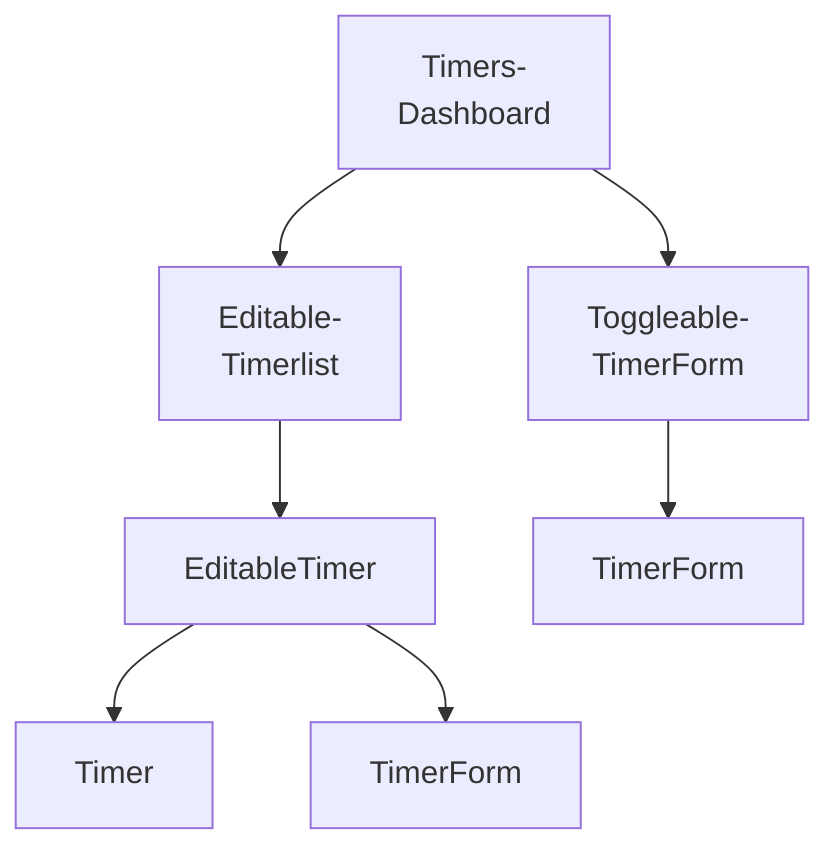

# Components

## Table of contents

1. [Breaking the app into components](#breaking-the-app-into-components)

---

## Breaking the app into components

    
More details

This app is structured by using two components: `TimerList` and `Timer`. However, the list of timers has a "+" icon at the bottom, used to add new timers. So the `TimerList` component also contains a widget to create new timers. Think about components as you would functions or objects. The single responsibility principle[^1] applies. A component should, ideally, only be responsible for one piece of functionality. Let's shrink `TimerList` back into its responsibility of just listing timers and to nest it under a parent component `TimersDashboard`. Not only does this separation of responsibilities keep components simple, but it often also improves their re-usability. In the future, we can now drop the `TimerList` component anywhere in the app where we just want to display a list of timers. This component no longer carries the responsibility of also creating timers, which might be a behavior we want to have for just this dashboard view. The "+" button has two distinc representations. When the "+" is clicked, the widget transmutes into a form. When the form is close, the widget transmutes back into a "+" button. There are two approaches we could take. The first one is to have the parent component, `TimersDashboard`, decide whether or not to render a “+” component or a form component based on some piece of stateful data. It could swap between the two children. However, this adds more responsibility to `TimersDashboard`. The alternative is to have a new child component own the single responsibility of determining whether or not to display a “+” button or a create timer form. We’ll call it `ToggleableTimerForm`. As a child, it can either render the component `TimerForm` or the HTML markup for the “+” button. The timer itself has a fair bit of functionality. It can transform into an edit form, delete itself, and start and stop itself. Do we need to break this up? And if so, how? Displaying a timer and editing a timer are indeed two distinct UI elements. They should be two distinct React components. Like `ToggleableTimerForm`, we need some container component that renders either the timer’s face or its edit form depending on if the timer is being edited. We’ll call this `EditableTimer`. The child of `EditableTimer` will then be either a `Timer` component or the edit form component. As for the other functionality of the timer, like the start and stop buttons, it’s a bit tough to determine at this point whether or not they should be their own components. We can trust that the answers will be more apparent after we’ve written some code. Working back up the component tree, we can see that the name `TimerList` would be a misnomer. It really is a `EditableTimerList`.

[^1]: [Single responsibility principle](https://en.wikipedia.org/wiki/Single_responsibility_principle)
