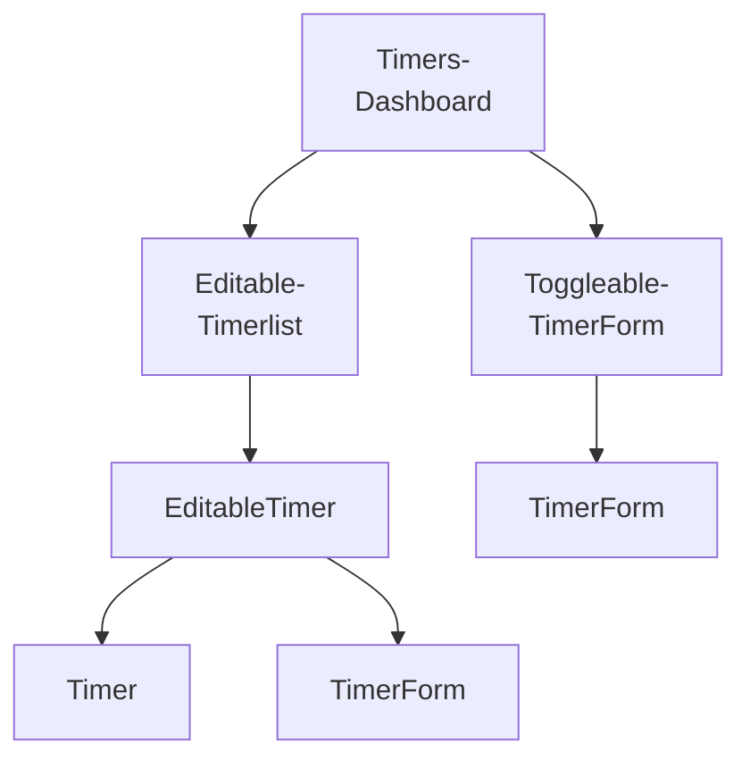

# Components

## Table of contents

1. [Breaking the app into components](#breaking-the-app-into-components)
2. [Steps for building React apps from scratch](#steps-for-building-react-apps-from-scratch)
3. [Build a static version of the app](#build-a-static-version-of-the-app)
4. [Determine what should be stateful]()

---

## Breaking the app into components



- `TimersDashboard`: Parent container
  - `EditableTimerList`: Displays a list of timer containers
    - `EditableTimer`: Displays either a timer or a timer's edit form
      - `Timer`: Displays a given timer
      - `TimerForm`: Displays a given timer's edit form
  - `ToggleableTimerForm`: Displays a form to create a new timer
    - `TimerForm`: Displays a new timer's create form

<details>
    <summary>More details</summary>

> This app is structured by using two components: `TimerList` and `Timer`. However, the list of timers has a "+" icon at the bottom, used to add new timers. So the `TimerList` component also contains a widget to create new timers. Think about components as you would functions or objects. The single responsibility principle[^1] applies. A component should, ideally, only be responsible for one piece of functionality. Let's shrink `TimerList` back into its responsibility of just listing timers and to nest it under a parent component `TimersDashboard`. Not only does this separation of responsibilities keep components simple, but it often also improves their re-usability. In the future, we can now drop the `TimerList` component anywhere in the app where we just want to display a list of timers. This component no longer carries the responsibility of also creating timers, which might be a behavior we want to have for just this dashboard view. The "+" button has two distinc representations. When the "+" is clicked, the widget transmutes into a form. When the form is close, the widget transmutes back into a "+" button. There are two approaches we could take. The first one is to have the parent component, `TimersDashboard`, decide whether or not to render a “+” component or a form component based on some piece of stateful data. It could swap between the two children. However, this adds more responsibility to `TimersDashboard`. The alternative is to have a new child component own the single responsibility of determining whether or not to display a “+” button or a create timer form. We’ll call it `ToggleableTimerForm`. As a child, it can either render the component `TimerForm` or the HTML markup for the “+” button. The timer itself has a fair bit of functionality. It can transform into an edit form, delete itself, and start and stop itself. Do we need to break this up? And if so, how? Displaying a timer and editing a timer are indeed two distinct UI elements. They should be two distinct React components. Like `ToggleableTimerForm`, we need some container component that renders either the timer’s face or its edit form depending on if the timer is being edited. We’ll call this `EditableTimer`. The child of `EditableTimer` will then be either a `Timer` component or the edit form component. As for the other functionality of the timer, like the start and stop buttons, it’s a bit tough to determine at this point whether or not they should be their own components. We can trust that the answers will be more apparent after we’ve written some code. Working back up the component tree, we can see that the name `TimerList` would be a misnomer. It really is a `EditableTimerList`.

</details>

---

## Steps for building React apps from scratch

The server will be the initial source of state, and React will render itself according to the data the server provides. Our app will also send updates to the server. Our React components will do little more than render HTML. A handy framework for developing a React app from scratch (we followed this pattern in the last project):

<details>
    <summary><b>1. Break the app into components</b></summary>

> We looked at the desired UI and determined we wanted `ProductList` and `Product` components.

</details>
<details>
    <summary><b>2. Build a static version of the app</b></summary>

> Our components started off without using `state`. Instead, we had `ProductList` pass down static props to `Product`

</details>
<details>
    <summary><b>3. Determine what should be stateful</b></summary>

> In order for our application to become interactive, we had to be able to modify the vote property on each product. Each product had to be mutable and therefore stateful.

</details>
<details>
    <summary><b>4. Determine in which component each piece of state should live</b></summary>

> `ProductList` managed the voting state using React component class methods.

</details>
<details>
    <summary><b>5. Hard-code initial state</b></summary>

> When we re-wrote `ProductList` to use `this.state`, we seeded it from `Seed.products`.

</details>
<details>
    <summary><b>6. Add inverse data flow</b></summary>

> We defined the `handleUpvote` function in `ProductList` and passed it down in props so that each `Product` could inform `ProductList` of up-vote events.

</details>
<details>
    <summary><b>7. Add server communication</b></summary>

> Will be covered in this project

</details>

---

## Build a static version of the app

```javascript
class TimersDashboard extends React.Component {
  render() {
    return (
      <div className="ui three column centered grid">
        <div className="column">
          <EditableTimerList />
          <ToggleableTimerForm isOpen={true} />
        </div>
      </div>
    );
  }
}
```

This component renders its two child components nested under `div` tags. `TimersDashboard` passes down one prop to `ToggleableTimerForm`: `isOpen`. This is used by the child component to determine whether to render a "+" or `TimerForm`: when is "open' the form is being displayed.

```javascript
class EditableTimerList extends React.Component {
  render() {
    return (
      <div id="timers">
        <EditableTimer
          title="Learn React"
          project="Web Domination"
          elapsed="8986300"
          runningSince={null}
          editFormOpen={false}
        />
        <EditableTimer
          title="Learn extreme ironing"
          project="World Domination"
          elapsed="3890985"
          runningSince={null}
          editFormOpen={true}
        />
      </div>
    );
  }
}
```

We're passing five props to each child component.

```javascript
class EditableTimer extends React.Component {
  render() {
    if (this.props.editFormOpen) {
      return (
        <TimerForm title={this.props.title} project={this.props.project} />
      );
    } else {
      return (
        <Timer
          title={this.props.title}
          project={this.props.project}
          elapsed={this.props.elapsed}
          runningSince={this.props.runningSince}
        />
      );
    }
  }
}
```

`EditableTimer` returns either a `TimerForm` or a `Timer` based on the prop `editFormOpen`

```javascript
class TimerForm extends React.Component {
  render() {
    const submitText = this.props.title ? "Update" : "Create";
    return (
      <div className="ui centered card">
        <div className="content">
          <div className="ui form">
            <div className="field">
              <label>Title</label>
              <input type="text" defaultValue={this.props.title} />
            </div>
            <div className="field">
              <label>Project</label>
              <input type="text" defaultValue={this.props.project} />
            </div>
            <div className="ui two bottom attached buttons">
              <button className="ui basic blue button">{submitText}</button>
              <button className="ui basic red button">Cancel</button>
            </div>
          </div>
        </div>
      </div>
    );
  }
}
```

Before the `return` statement, we define a variable `submitText`. This variable uses the presence of `this.props.title` to determine what text the submit button should display.

```javascript
class ToggleableTimerForm extends React.Component {
  render() {
    if (this.props.isOpen) {
      return <TimerForm />;
    } else {
      return (
        <div className="ui basic content center aligned segment">
          <button className="ui basic button icon">
            <i className="plus icon" />
          </button>
        </div>
      );
    }
  }
}
```

As noted earlier, `TimerForm` does not receive any props from `ToggleableTimerForm`. As such, `itstitle` and `project` fields will be rendered empty.

```javascript
class Timer extends React.Component {
  render() {
    const elapsedString = helpers.renderElapsedString(this.props.elapsed);
    return (
      <div className="ui centered card">
        <div className="content">
          <div className="header">{this.props.title}</div>
          <div className="meta">{this.props.project}</div>
          <div className="center aligned description">
            <h2>{elapsedString}</h2>
          </div>
          <div className="extra content">
            <span className="right floated edit icon">
              <i className="edit icon" />
            </span>
            <span className="right floated trash icon">
              <i className="trash icon" />
            </span>
          </div>
        </div>
        <div className="ui bottom attached blue basic button">Start</div>
      </div>
    );
  }
}
```

`elapsed` in this app is in milliseconds. We use a function defined in `helpers.js`, `renderElapsedString()` to render the string in the format "HH:MM:SS"
With all of the components defined, is time to render the app with `ReactDOM.render()`:

```javascript
ReactDOM.render(<TimersDashboard />, document.getElementById("content"));
```

---

## Determine what should be stateful

[^1]: [Single responsibility principle](https://en.wikipedia.org/wiki/Single_responsibility_principle)
