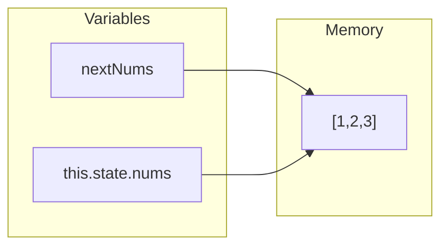
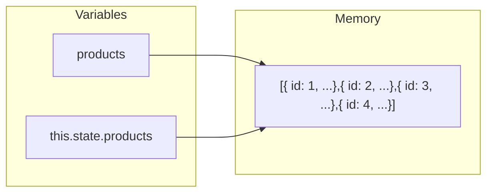

# First React App

## Table of contents

1. [Prepare the app](#prepare-the-app)
2. [What's a component?](#whats-a-component)
3. [JSX](#jsx)
4. [Babel](#babel)
5. [ReactDOM.render()](#reactdomrender)
6. [Product component](#product-component)
7. [Props](#props)
8. [Rendering multiple components](#rendering-multiple-components)
9. [First interaction](#first-interaction)
10. [Binding custom component methods](#binding-custom-component-methods)
11. [State](#state)
12. [Updating state and immutability](#updating-state-and-immutability)
13. [Refactoring with the Babel plugin](#refactoring-with-the-babel-plugin)

---

## Prepare the app

To prepare the app, first we need to use `npm install` to install dependencies, then `npm start` to start the app. It will be availabe at the URL `http://localhost:3000`.
When we ran `npm install`, npm used our `package.json` to determine what dependencies to download and install (installed in the folder `node_modules`)
The code we'll be working with is inside the folder `public/`. Inside this folder there is `index.html`, which is the centerpiece of our app and loads in the rest of our app's assets. The dependencies are being loaded under the `<head>` tag.

```html
<head>
  <meta charset="utf-8" />
  <title>Project One</title>
  <link rel="stylesheet" href="./semantic-dist/semantic.css" />
  <link rel="stylesheet" href="./style.css" />
  <script src="vendor/babel-standalone.js"></script>
  <script src="vendor/react.js"></script>
  <script src="vendor/react-dom.js"></script>
</head>
```

> For this project, we're using Semantic UI[^1]. It is a CSS framework that provides us with a grid sysyem and some simple styling.

---

## What's a component?

Building a React app is all about components. An individual component can be thought of as a UI component in an app.Not only do React components map cleanly to UI components, but they are selfcontained. The markup, view logic, and often component-specific style is all housed in one place. This feature makes React components reusable

```javascript
class ProductList extends React.Component {
  render() {
    return (
      <div className="ui unstackable items">
        Hello, friend! I am a basic React component.
      </div>
    );
  }
}
```

React components are ES6 classes that extend the class `React.Component`. `render()` is the only required method for a React component. React uses the return value from this method to determine what to render to the page. The syntax of the return value is JSX (JavaScript eXtension syntax)

---

## JSX

React components ultimately render HTML which is displayed in the browser. As such, the `render()` method of a component needs to describe how the view should be represented as HTML. React builds our apps with a fake representation of the DOM, it calls this the _virtual DOM_. JSX was created to make this JavaScript representation of HTML more HTML-like. JSX presents a light abstraction over the JavaScript version, yet the legibility benefits are huge. Readability boosts our app’s longevity and makes it easier to onboard new developers.

```javascript
React.createElement("div", {className: "ui items},
    React.createElement("p", null, "Hello, friend! I am a basic React component.")
)
```

in JSX:

```HTML
<div className="ui items">
    <p>
        Hello, friend! I am a basic React component.
    </p>
</div>
```

---

## Babel

Most browsers in use today do not fully support ES6. Babel is a JavaScript transpiler, it turns ES6 code into ES5 code. We call this process transpiling. Another handy feature of Babel is that it understands JSX. Babel compiles our JSX into vanilla ES5 JS that our browser can then interpret and execute. We just need to instruct the browser that we want to use Babel to compile and run our JavaScript code. All we need to do is tell our JavaScript runtime that our code should be compiled by Babel. We can do this by setting the `type` attribute when we import the script in `index.html` to `text/babel`.

```html
<script
  type="text/babel"
  data-plugins="transform-class-properties"
  src="./js/app.js"
></script>
```

---

## ReactDOM.render()

We need to instruct React to render the `ProductList` component inside a specific DOM node.

```javascript
class ProductList extends React.Component {
  render() {
    return (
      <div className="ui unstackable items">
        Hello, friend! I am a basic React component.
      </div>
    );
  }
}

ReactDOM.render(<ProductList />, document.getElementById("content"));
```

`ReactDOM` is from the `react-dom` library that we also include in `index.html`. We pass in two arguments to the `ReactDOM.render()` method:

```javascript
ReactDOM.render([what], [where]);
```

For the "what" we're passing in a reference to our React component `ProductList` in JSX. For the "where", we pass in a reference to the DOM node.
In React, native HTML elements always start with a lowercase letter whereas React component names always start with an uppercase letter.

---

## Product component

```javascript
class Product extends React.Component {
  render() {
    return (
      <div className="item">
        <div className="image">
          
        </div>
        <div className="middle aligned content">
          <div className="description">
            <a>Fort Knight</a>
            <p>Authentic renaissance actors, delivered in just two weeks</p>
          </div>
          <div className="extra">
            <span>Submitted by:</span>
            
          </div>
        </div>
      </div>
    );
  }
}
```

At the moment, the `Product` component is static with hard-coded values. To use this component in a meaningful way, we'll want to change it to be data-driven and therefore dynamic. Driving the `Product` component with data will allow us to dynamically render the component based upon the data that we give it.
`seed.js` contains some example data for our products (it will "seed" or app's data). Each product has a unique `id` and a handful of properties.

---

## Props

We want to modify our `Product` component so that it no longer uses static, hard-coded attributes. Instead, we want it to be able to accept data passed down from its parent, `ProductList`. Setting up our component structure in this way enables our `ProductList` component to dynamically render any number of `Product` components that each have their own unique attributes. Data flow will look like this:


The way data flows from parent to child in React is through props. When a parent renders a child, it can send along props the child depens on.

```javascript
class ProductList extends React.Component {
  render() {
    const product = Seed.products[0];
    return (
      <div className="ui unstackable items">
        <Product
          id={product.id}
          title={product.title}
          description={product.description}
          url={product.url}
          votes={product.votes}
          submitterAvatarUrl={product.submitterAvatarUrl}
          productImageUrl={product.productImageUrl}
        />
      </div>
    );
  }
}
```

The `product` variable is set to a JavaScript object that describes the first of our products. We pass the product's attributes along individually `Product` component using the syntax `[propName]=[propValue]`. In JSX, braces are a delimiter, signaling to JSX that what resides in-between the braces is a JavaScript expression. The other delimiter is using quotes for strings.

> JSX attribute values must be delimited by either braces or quotes. If type is important and we want to pass in something like a Number or `null`, use braces

In React, a component can access all its props through the object `this.props`. Inside of `Product`, the `this.props` object will look like this:

```json
{
  "id": 1,
  "title": "Yellow Pail",
  "description": "On-demand sand castle construction expertise.",
  "url": "#",
  "votes": 41,
  "submitterAvatarURL": "images/avatars/daniel.jpg",
  "productImageUrl": "images/products/image-aqua.png"
}
```

Interweaving props with HTML elements in this way is how we create dynamic, data-driven React component.

> `this` is aspecial keyword in JavaScript. For the purpose of the course, `this` will be bound to the React component class. [^2]

---

## Rendering multiple components

To render multiple products, first we'll have `ProductList` generate an array of `Product` components. Each will be derived from an individual object in the `Seed` array. We'll use `map` to do so:

```javascript
class ProductList extends React.Component {
  render() {
    const productComponents = Seed.products.map((product) => (
      <Product
        key={`product-${product.id}`}
        id={product.id}
        title={product.title}
        description={product.description}
        url={product.url}
        votes={product.votes}
        submitterAvatarUrl={product.submitterAvatarUrl}
        productImageUrl={product.productImageUrl}
      />
    ));
    return <div className="ui unstackable items">{productComponents}</div>;
  }
}
```

The function passed to `map` returns a `Product` component. This `Product` is created just as before with props pulled from the object in `Seed`. As suchem the `productComponents` variable ends up being an array of `Product` components. Babel will transpile the JSX representation of each `Product (<Product/>)` into regular JavaScript.

> Array's `map` method takes a function as an argument. It calls this function with each item inside of the array (in this case, each object inside `Seed.products`) and builds a new array by using the return value from each function call. Because the `Seed.products` array has fouritems, `map` will call this function four times, once for each item. When `map` calls this function, it passes in as the first argument an item. The return value from this function call is inserted into the new array that `map` is constructing. After handling the last item, `map` returns this new array. Here, we’re storing this new array in the variable productComponents.

> The `` key=${`product-id${product.id}`} `` prop is used by React to create unique bindings for each instance of the `Product` component. The `key` prop is not used by our `Product` component, but by the React framework.

At the moment, our products aren't sorted by the number of votes they have. We'll use Array's sort method to sort them:

```javascript
class ProductList extends React.Component {
  render() {
    const products = Seed.products.sort((a, b) => b.votes - a.votes);
    const productComponents = products.map((product) => (
      <Product
      // ...
```

> Array's `sort()` method mutates the original array it was called on. It takes an optional function as an argument. If the function is omitted, it will just sort the array by each item's Unicode code point value. This is rarely what a programmer desires. If a function is supplied, elements are sorted according to the function's return value. On each iteration, the arguments `a` and `b` are two subsequent elements in the array. Sorting depends on the return value of the function:
>
> 1. If the return value is less than 0, `a` should come first (have a lower index)
> 2. If the return value is greater than 0, `b` should come first.
> 3. If the return value is equal to 0, leave order of `a` and `b` unchanged with respect to each order.

---

## First interaction

When the up-vote button on each button on each one of the `Product` components is clicked, we expect it to update the `votes` attribute for that `Product`, increasing it by one. But `this.props` is immutable. While the child can read its props, it can't modify them. A child does not own its props. React favors the idea of _one-way data flow_. This means that data changes come from the "top" of the app and are propagated "downwards" through its various components. We need a way for the `Product` component to let `ProductList` know that a click
on its up-vote icon occurred. We can then have ProductList, the owner of the product’s data, update the vote count for that product. The updated data will then flow downward from the `ProductList` component to the `Product` component.
We can pass `functions` as props too. We can have the `ProductList` component give each `Product` component a function to call when the up-vote is clicked. Functions passed down through props are the canonical manner in which children communicate events with thei parent components.

```javascript
class ProductList extends React.Component {
  handleProductUpVote(productId) {
    console.log(`${productId} was upvoted`);
  }
  render() {
    const products = Seed.products.sort((a, b) => b.votes - a.votes);
    const productComponents = products.map((product) => (
      <Product
        key={`product-${product.id}`}
        id={product.id}
        title={product.title}
        description={product.description}
        url={product.url}
        votes={product.votes}
        submitterAvatarUrl={product.submitterAvatarUrl}
        productImageUrl={product.productImageUrl}
        onVote={this.handleProductUpVote}
      />
    ));
    return <div className="ui unstackable items">{productComponents}</div>;
  }
}

class Product extends React.Component {
  handleUpVote() {
    this.props.onVote(this.props.id);
  }
  render() {
    return (
      <div className="item">
        <div className="image">
          
        </div>
        <div className="middle aligned content">
          <div className="header">
            <a onClick={this.handleUpVote}>
              <i className="large caret up icon" />
            </a>
    // ...
```

We can now access this function inside `Product` via `this.props.onVote`. We invoke the prop-function `this.props.onVote` with the `id` of the product. In React, we can use the special attribute `onClick` to handle mouse click events.
When the user clicks the up-vote icon, it will trigger a chain of function calls:

1. User clicks the up-vote icon.
2. React invokes `Product` component's `handleUpVote`.
3. `handleUpVote` invokes its prop `onVote`. This function lives inside the parent `ProductList` and logs a message to the console.

When working inside `render()`, we've witnessed that `this` is always bound to the component. But inside our custom component method `handleUpVote()`, `this` is actually `null`.

---

## Binding custom component methods

In JavaScript, the special `this` variable has a different binding depending on the context. For instance, inside `render()` we say that `this` is "bound" to the component. Put another way, `this` "references" the component. We want `this` inside `handleUpVote()` to reference the component, just like it does inside `render()`. But why does this inside `render()` reference the component while this inside `handleUpVote()` does not? For the `render()` function, React binds `this` to the component for us. React specifies a default set of special API methods, `render()` is one of them. So, any time we define our own custom component methods, we have to manually bind `this` to the component ourselves.

```javascript
class Product extends React.Component {
  constructor(props) {
    super(props);
    this.handleUpVote = this.handleUpVote.bind(this);
  }
```

`constructor()` is a special function in a JavaScript class. JavaScript invokes `constructor()` whenever an object is created via a class. React invokes `constructor()` first thing when initializing our component, with the component's props.

> The first thing we do in `constructor()` is call `super(props`). The `React.Component` class that our `Product` class is extending defines its own `constructor()`. By calling `super(props)`, we're invoking that `constructor()` function first. Importantly, the `constructor()` function defined by `React.Component` will bind this inside our `constructor()` to the component. Because of `this`, it’s a good practice to always call `super()` first whenever you declare a `constructor()` for your component. After calling `super()`, we call `bind()` on our custom component method:

> ```javascript
> this.handleUpVote = this.handleUpVote.bind(this);
> ```

> Function's `bind()` method allows you to specify what the `this` variable inside a function body should be set to. What we're doing here is a common JavaScript pattern. We're redefining the component method `handleUpVote()`, setting it to the same function but bound to `this` (the component). Now, whenever `handleUpVote()` executes, `this` will reference the component as opposed to `null`

---

## State

Whereas props are immutable and owned by a component's parent, state is owned by the component. `this.state` is private to the component and it can be update with `this.setState()`. When the state or props of a component update, the component will re-render itself. Every React component is rendered as a function of its "props" and "state". This rendering is deterministic. This means that given a set of props and a set of state, a React component will always render a single way. Because we are mutating the data for our products (the number of votes), we should consider this data to be stateful. `ProducList` will be the owner of this state. It will then pass this state down as props to `Product`
At the moment, `ProductList` is reading directly from `Seed` inside `render()` to grab the products. Let’s move this data into the component’s state. When adding `state` to a component, the first thing we do is define what the initial state should look like. Because `constructor()` is called when initializing our component, it’s the best place to define our initial state. In React components, state is an object.

```javascript
class ProductList extends React.Component {
  constructor(props) {
    super(props);
    this.state = {
      products: [],
    };
  }
  handleProductUpVote(productId) {
    console.log(`${productId} was upvoted`);
  }
  render() {
    const products = this.state.products.sort((a, b) => b.votes - a.votes);
```

We have initialized our state to an object with an empty `products` array.

> Technically, because we don't supply `ProductList` any props, we don't need to propagate the `props` argument to `super()`. But it's a good habit to get into and helps avoid odd bugs in the future.

With our state initialized, the `ProductList` component's `render` function uses state as opposed to reading from `Seed`.
It's a good practice to initialize components with "empty" state as we've done here. After our component is initialized, we want to seed the state for `ProductList` with the data in `Seed`.
React specifies a set of **lifecycle methods**. React invokes one lifecycle method, `componentDidMount()`, after our component has mounted to the page. For all state modifications after the initial state, React provides components the method `this.setState()`. Among other things, this method triggers the React component to re-render which is essential after the state changes.

```javascript
class ProductList extends React.Component {
  constructor(props) {
    super(props);
    this.state = {
      products: [],
    };
  }

  componentDidMount() {
    this.setState({ products: Seed.products });
  }
```

The component will mount with an empty state `this.state.products` array. After mounting, we populate the state with data from `Seed`. The component will re-render and our products will be displayed. This happens at a speed that is imperceptible to the user.

---

## Updating state and immutability

Now that `ProductList` is managing the products in state, we're poised to make modifications to this data in response to user input. We want to increment the `votes` property on a product when the user votes for it. While a component can update its state, we should treat the `this.state` object as immutable. Let's say we have an array of numbers in state:

```javascript
this.setState({ nums: [1, 2, 3] });
```

If we want to update the state's `nums` array to include a 4, we might be temted to use `push()`:

```javascript
this.setState({ nums: (this.state.nums.push(4), this.state.nums) });
```

On the surface, it might appear as though we've treated `this.state` as immutable, but `push()` modifies the original array.

```javascript
console.log(this.state.nums); // [1, 2, 3]
this.state.nums.push(4);
console.log(this.state.nums); // [1, 2, 3, 4]
```

Although we invoke `this.setState()` immediately after we push 4 onto the array, we are still modifying `this.state` outside of `setState()` and this is bad practice. Part of the reason this is bad practice is because `setState()` is actually asynchronous. There is no guarantee when React will update the state and re-render our component.

```javascript
const nextNums = this.state.nums;
nextNums.push(4);
console.log(nextNums); // [1, 2, 3, 4]
console.log(this.state.nums); // [1, 2, 3, 4]
```

Our new variable `nextNums` references the same array as `this.state.nums` in memory:



Array's `concat()` creates a new array that contains the elements of the array it was called on followed by the elements passed in as arguments.
Knowing that we want to treat the state as immutable, the following approach to handling up-voteswould be problematic:

```javascript
handleProductUpVote(productId) {
  const products = this.state.products;
  products.forEach((product) => {
    if (product.id === productId) {
      product.votes = product.votes + 1;
    }
  });
  this.setState({
    products: products,
  });
}
```

When we initialize `products` to `this.state.products`, `products` references the same array in memory as `this.state.products`



We should create a new array of products and, if we modify one of the product objects, we should modify a clone of the object as opposed to the original one.

```javascript
class ProductList extends React.Component {
  constructor(props) {
    super(props);
    this.state = {
      products: [],
    };

    this.handleProductUpVote = this.handleProductUpVote.bind(this);
  }

  componentDidMount() {
    this.setState({ products: Seed.products });
  }

  handleProductUpVote(productId) {
    const nextProducts = this.state.products.map((product) => {
      if (product.id === productId) {
        return Object.assign({}, product, {
          votes: product.votes + 1,
        });
      } else {
        return product;
      }
    });
    this.setState({
      products: nextProducts,
    });
  }
```

We use `map()` to traverse the `products` array. It returns a new array. Next, we check if the current `product` matches `productId`. If it does, we create a new object, copying over the properties from the original product object. We then overwrite the `votes` property on our new product object. We set it to the incremented vote count. We do this using Object's `assign()` method. If the current `product` is not the one specified by `productId`, we return it unmodified. Finally, we use `setState()` to update the state. `map()` is creating a new array. So you might ask: Why can’t we modify the product object directly? While we're creating a new array, the variable `product` here still references the product object sitting on the original array in state. Therefore, if wwe make changes to it we'll be modifying the object in state. So we use `Object.assign()` to clone the original into a new object and then modify the `votes` property on that new object.

---

## Refactoring with the Babel plugin

[^1]: [Semantic UI](https://semantic-ui.com/)
[^2]: [this](https://developer.mozilla.org/en-US/docs/Web/JavaScript/Reference/Operators/this)
